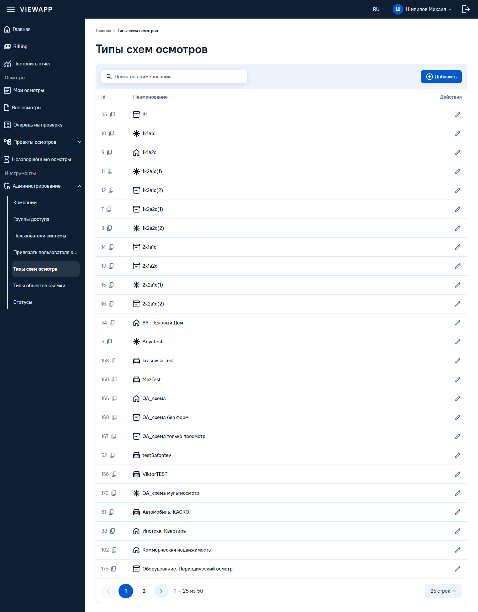
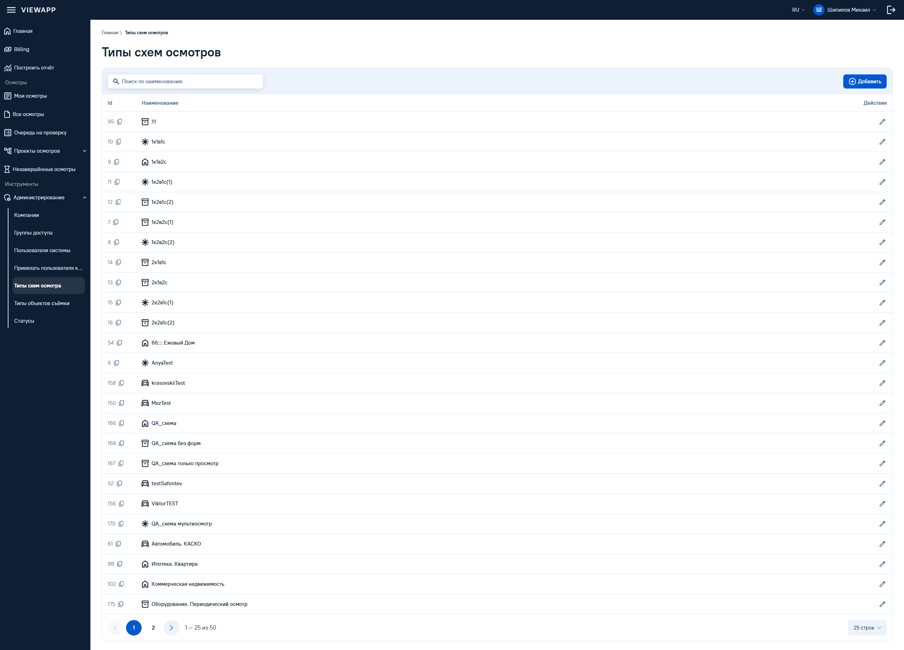
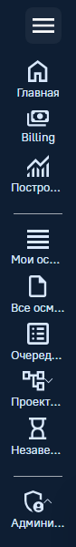
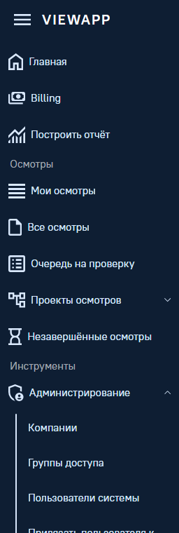
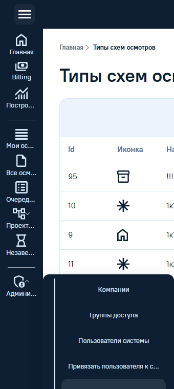
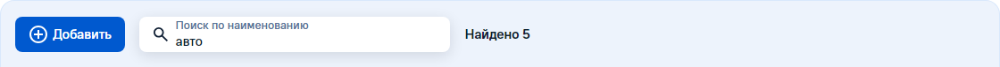
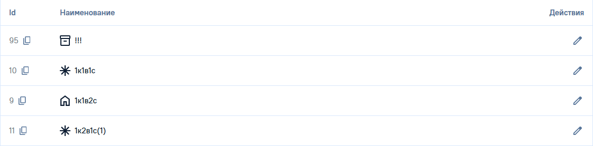
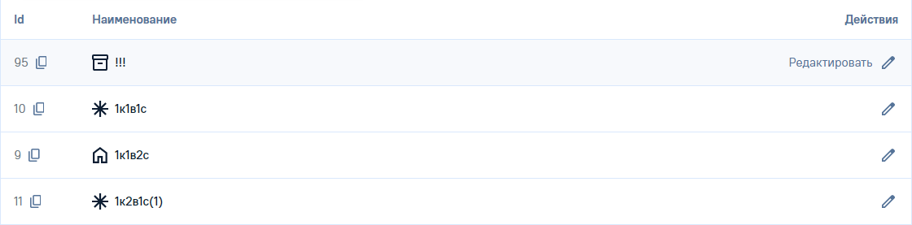

# Вторая тестовая страница: «Типы схем осмотров»

Собрана 2026-08-18, тактом 8. Роут `/insure-types`, каркас — общий layout `admin`.

Назначение — **демо для фронт-лида**: контраст «кастомная админка сейчас → та же страница на
ДС». Поэтому это не пиксельная копия оригинала, а аккуратная версия на реестре.

## Чего у этой страницы нет

| Чего нет | Что из этого следует |
|---|---|
| **макета в Figma** | композиционные решения приняты по образцу «Мои осмотры» и правилам `naming.md`; каждое спорное — ниже, с провенансом «решение сборки» |
| **живой страницы оригинала** | она за логином |
| ~~скриншотов оригинала~~ | пришли довеском к такту 8 и сверены построчно — разбор в конце документа. Первая сборка шла по текстовому описанию, поэтому часть решений пришлось переделать |

Расхождения с оригиналом админки **дефектами не считаются**: это замысел демо. В таблицу
расхождений ниже идут только расхождения с мастерами ДС.

| 1440 | 2560 |
|---|---|
|  |  |

## Каркас заведён общим, но переезд «Мои осмотры» — отдельная задача

`app/layouts/admin.vue` — тёмный сайдбар во всю высоту, тёмная верхняя панель справа от него,
светлая область содержимого. Каркас общий по смыслу, и «Мои осмотры» на него **не переведены**:
там шапка идёт во всю ширину поверх рельса, и перевод сдвинет раскладку, на которую наложение
уже сходится. Проверено после правки — страница «Мои осмотры» не изменилась.

Чтобы каркасы вообще заработали, `app.vue` обёрнут в `NuxtLayout`. Страницы без `layout` в
`definePageMeta` от этого не меняются: дефолтного каркаса в проекте нет намеренно.

## Компоненты

### Переиспользовано без единой правки

`Menu`, `MenuItem`, `MenuSub`, `Avatar`, `Icon`, `Breadcrumb`, `ButtonNavigation`, `Button`,
`Table`, `TableRow`, `TableHead`, `TableCell`, `TableCellText`, `TableFooter`, `IconButton`,
`Pagination`, `Popover`, `SelectItem`.

Восемнадцать компонентов реестра; ни одного локального стиля мимо токенов.

### Заведено и расширено тактом 8

| Что | Где | Источник |
|---|---|---|
| `MenuSection` — раздел сайдбара с подписью | `menu/MenuSection.vue` | **мастера нет**: у `Menu` `3499:24661` внутри только стек пунктов. Собрано ближайшим системным способом — разделитель рельса «Мои осмотры» плюс подпись 13/16 Medium на `--sidebar-foreground`. Метка `@debt` |
| тип `sidebar` у `IconButton` | `icon-button/index.ts` | правило порталов сайдбара: пять прежних типов стоят на светлых ролях, внутри тёмной полосы они незаконны. Заливка и цвет наведения взяты у соседнего пункта — состояния `_MenuItemMaster` `3465:22566` |
| эмит `toggle` у `MenuSub` | `menu/MenuSub.vue` | раскрытие у мастера — ось, а не память компонента; наружу нужен факт нажатия **на триггер**, иначе клик по вложенной строке схлопывает раздел |
| `direction="none"` у `ButtonNavigation` | `button-navigation/` | у последнего уровня крошек стрелке указывать некуда. В мастере она нарисована у всех десяти — демонстрационная начинка, отмеченная ещё волной 2; средства её убрать у автора страницы не было |
| глифы `edit`, `menu`, `car`, `package` | `icon/icons.ts` | официальная выгрузка Material, границы контура сняты `getBBox` — штатный канал протокола иконок |

## Решения сборки — провенанс «решение сборки»

Макета нет, поэтому каждое решение опирается либо на образец «Мои осмотры», либо на правило.

| Что | Решение | Почему так |
|---|---|---|
| логотип в сайдбаре, а не в верхней панели | сайдбар занимает всю высоту, панель начинается от его правого края | бургер стоит рядом с логотипом, то есть управляет сайдбаром. У «Мои осмотры» иначе — там шапка во всю ширину; это два разных каркаса, и второй не «неправильный» |
| верхняя панель тёмная | `bg-sidebar`, содержимое на `sidebar-*` | образец «Мои осмотры» |
| подпункты второго уровня без иконок | `:show-icon="false"` | булев проп `Show Icon` есть у мастера. Придумывать иконку каждому подпункту — выдумывать смысл там, где его нет |
| активен подпункт, а не его раздел | `Администрирование` раскрыт, но не подсвечен | подсветка обоих читается как два выбранных пункта. В мастере раскрытый список нарисован только на выбранной строке — эту связку не переносим, `open` и `selected` независимы |
| панель «Добавить» — плашка над таблицей | `bg-secondary`, радиус 16, высота 76 | образец панели действий «Мои осмотры». В ките 1 такая панель входит **внутрь** контейнера таблицы, но решением владельца от 2026-08-18 она вынесена наружу — `figma-fixes.md` |
| ширины колонок | Id 96, Иконка 96, Наименование резиновая, Действия 192 | макета нет; содержательная колонка забирает остаток, служебные — по содержимому |
| высота строки 56, а не 72 | `size="56"` | в строке одна строка текста и кнопка, а не превью с тремя строками подписи. 56 — ступень того же мастера `Cell` `3349:22376` |
| «Редактировать» — тональная кнопка | `variant="secondary"`, размер md | outline-варианта у `Button` в ките нет вовсе. Размер md, а не sm: у малой кнопки слота иконки в мастере нет |
| закрепления колонок нет | `sticky` не задан | таблица помещается в ширину, закреплять нечего |
| иконки типов | по смыслу из набора | у технических схем (`1к2в1с(1)`, `AnyaTest`) смысла нет — им достался нейтральный `draft` |

## Демо-данные

Двадцать строк перенесены со скриншотов дословно, включая `!!!` и `66::: Ежовый Дом`: реальные
имена честнее, а длинные и странные заодно проверяют вёрстку ячейки. Остальные тридцать —
правдоподобные, чтобы страница показывала 25 строк из 50 и было чем оживить пагинацию.

Состав подпунктов «Проекты осмотров» на скриншотах не раскрыт — там демо-контент.

## Что живое, а что заглушка

| Живое | Проверено |
|---|---|
| пагинация | вторая страница даёт «26 – 50 из 50», первая строка `171 QA_схема архив` |
| переключатель размера страницы | 25 / 50 / 100, счётчик и число строк меняются |
| сворачивание разделов сайдбара | «Проекты осмотров» раскрываются, «Администрирование» схлопывается; клик по вложенной строке раздел не трогает |
| сворачивание сайдбара бургером | полоса 296 → 56, подписи и заголовки разделов исчезают |

| Заглушка | Почему |
|---|---|
| «Добавить» | обработчика нет намеренно: демо показывает вид и состояния, а не форму создания |
| «Редактировать» в строке | то же |

**Ограничение демо.** В свёрнутом сайдбаре разделы с подменю не раскрываются: у Атома подменю в
компактном режиме уезжает плашкой `MenuPopover`, и этот путь не собран. Компонент в реестре есть,
работа — отдельная.

## Таблица расхождений с мастерами ДС

| Что | Категория | Замер | Что сделано |
|---|---|---|---|
| **заголовка раздела в меню нет** | дыра системы | у `Menu` `3499:24661` внутри только стек пунктов | собран `MenuSection` ближайшим системным способом, метка `@debt`, строка в `design-debt.md` |
| **ступени «приглушённый текст меню» нет** | дыра системы | единственная неяркая роль в теме — `--sidebar-disabled`, а заголовок раздела не выключен | подпись стоит на обычном `--sidebar-foreground`, на ступень мельче пункта. Просьба дизайнерам — в `figma-fixes.md` |
| **текстовой кнопки на тёмном нет** | дыра системы | `Button` весь на светлых ролях | язык и профиль в верхней панели собраны композицией, как в «Мои осмотры» |
| **иконочной кнопки на тёмном нет** | дыра системы, закрыта | у `ButtonSimple` `110:1566` четыре типа, все на светлых ролях | заведён тип `sidebar` — ступени взяты у пункта меню, новых токенов нет |
| **у крошки нельзя убрать стрелку** | дефект компонента | в мастере стрелка у всех десяти крошек, включая последнюю | добавлено `direction="none"` |
| **смена размера страницы не пересчитывала номер** | дефект компонента | со второй страницы по 25 переход на 50 давал «51 – 50 из 50» и пустую таблицу | `TableFooter` прижимает номер к последней существующей странице. В «Мои осмотры» дефект был не виден: там 64 787 записей, вторая страница существует при любом размере |
| **пикт `автомобиль` и `коробка` в наборе не было** | отсутствие | — | добавлены штатным каналом: официальная выгрузка Material, границы через `getBBox` |

## Проверки

Автопроверки прогнаны по самой странице, а не только по `/compare`: она лежит в своём документе.

| Проверка | Результат |
|---|---|
| автопроверка шрифтов | 407 текстовых узлов внутри `[data-slot]`, провалов нет |
| автопроверка оптики иконок | 70 иконок, провалов нет |
| `/compare` после правок | 361 текстовый узел и 114 иконок, провалов нет — не сломалось |
| «Мои осмотры» после включения каркасов | 10 карточек, одна шапка, одно меню — страница не изменилась |
| хардкод | значений мимо токенов нет ни в странице, ни в каркасе |

Снимки сняты с живой витрины тем же способом, что у «Мои осмотры»; свёрнутый сайдбар — кликом
через CDP, потому что headless не умеет нажимать сам.

## Довесок к такту 8: сверка со скриншотами оригинала

Скриншоты пришли после сборки. Сверял состав и порядок пунктов сайдбара, иконки типов,
композицию контентной области и подвал. Расхождения вида дефектами не считаются — но состав
данных и **смысл иконок** обязаны совпадать, поэтому переделаны они.

| Что | Было (решение сборки вслепую) | Стало (по оригиналу) |
|---|---|---|
| **иконки типов** | восемь разных глифов по смыслу имени: `layers`, `image`, `archive`, `block`, `location`, `refresh`, `account-tree`, `draft` | **ровно четыре**, как в оригинале: дом, автомобиль, коробка-посылка, звёздочка. Расставлены построчно по скринам, у дописанных строк — из тех же четырёх |
| **композиция контентной области** | панель с «Добавить» отдельной плашкой над таблицей, зазор 24 | **один контейнер**: панель — верхняя часть, под ней таблица, под ней подвал. Так же собран фрейм `table` `19601:29061` кита 1 |
| **иконка «Добавить»** | голый плюс `add` | кружок с плюсом `add-circle` — как в оригинале |
| **шеврон раздела сайдбара** | смотрел вниз всегда | разворачивается на раскрытом разделе, как в оригинале |
| **«Очередь на проверку» / «Незавершённые осмотры»** | песочные часы стояли у очереди, часы у незавершённых | песочные часы — у незавершённых, список — у очереди. Смысл был перепутан |
| **«Мои осмотры»** | `list` | `view-list`: `list` уехал очереди |

Совпало без правок: состав и порядок пунктов сайдбара со всеми подпунктами, порядок и номера
двадцати строк таблицы, колонки, подвал (2 страницы, «1 – 25 из 50», «25 строк»), активный
подпункт, разделы «Осмотры» и «Инструменты» с подписями.

### Что заведено довеском

| Что | Источник |
|---|---|
| глифы `asterisk`, `add-circle` | официальная выгрузка Material, границы через `getBBox` |
| `TableToolbar` | `table_header` `19601:29062` кита 1: верхняя часть контейнера таблицы — заливка `accent/surface_soft`, высота 76, верхние углы 16, нижней рамки нет |
| проп `attached-top` у `Table` | тот же фрейм: если сверху панель, углы и рамку несёт она |
| проп `expanded` у `MenuItem` | поворот шеврона раскрытого раздела. В мастере стрелка одна на оба состояния — поворот наш, как у аккордеона |

### Не тронул: противоречие источников

В оригинале стрелки подвала стоят **в рамках**. У кита 1 так же — `pagination_group`
`19601:29083` рисует их как `btn_secondary` 44 высотой. У Атома, откуда `Pagination`
переносилась волной 5, стрелка — **голый шеврон** 6×16, никаких плашек.

Два источника отвечают по-разному, правка общая и поедет в «Мои осмотры» — это блокер по
правилу «дубли с разным визуалом». Вопрос 33 в `docs/open-questions.md`.

### Осталось расхождением вида — намеренно

| Что | Оригинал | У нас | Почему так |
|---|---|---|---|
| заливка панели «Добавить» | белая, как весь контейнер | `accent/surface_soft` | так у кита 1 в `table_header` и так же выглядит панель действий «Мои осмотры». Контейнер один в обоих случаях, различается только тон верхней части |
| плашка у невыбранного номера страницы | светлая заливка | без заливки | у кита 1 `page_number` без заливки — залит только активный |
| аватар в верхней панели | цветная эмблема | буква на брендовой заливке | `Avatar` реестра; картинки пользователя в демо нет |
| иконка `AnyaTest` | на скрине не читается | звёздочка | глиф не опознан по растру; если он значащий — поправлю по подсказке |

## Такт 9: сайдбар пересобран по мастеру кита 1

Такт 8 собрал сайдбар без источника вовсе — по образцу «Мои осмотры» и правилам сборки. Мастер
`left_menu` кита 1 (страница `281:62442`, узлы `643:3053`/`644:6545`, шапка `643:2253`/`643:2255`)
подтвердил часть решений и опроверг геометрию. Разбор с числами — `docs/naming.md`, раздел
«Такт 9: у сайдбара два источника».

| Ширина, высота, радиус | Атом (было) | кит 1 (стало) |
|---|---|---|
| ширина развёрнутая / компактная | 296 / 56 | **256 / 84** |
| высота пункта | 44 | **48** |
| радиус пункта | 8 | **12** |
| шапка сайдбара | `px-4`, решение сборки | **`pl-3`**, замер `top_menu` `643:2253` |

Дефолт `Menu` остался атомовским (на него сходится наложение волны 5 и вся сверка «Мои
осмотры»); каркас `admin.vue` переведён на `variant="kit1"` — решение владельца, такт 9.

| Свёрнутый | Флаут подменю в свёрнутом виде |
|---|---|
|  |  |

### Было решение сборки → стало по мастеру

| № | Было (такт 8, без источника) | Стало (такт 9, по мастеру) |
|---|---|---|
| 1 | заголовок раздела — разделитель рельса «Мои осмотры» плюс подпись 13/16 Medium, метка `@debt` | `menu_devider` кита 1: подпись 15/20 Regular на `menu/devider/default` `#a2a9b2`, в компакте — линия 54×1 по центру. Метка `@debt` снята |
| 2 | ступень «приглушённый текст меню» — дыра, подпись стояла на обычном `--sidebar-foreground` | закрыто тем же `menu/devider/default` — она и есть искомая приглушённая ступень, новый токен не понадобился |
| 3 | ширина сайдбара 296/56 (атомовский перенос без проверки) | **256/84** — замер `left_menu` |
| 4 | высота пункта 44, радиус 8 | **48 / 12** |
| 5 | компактный режим — только иконка | иконка **и подпись** 13/16 под ней, зазор 4 |
| 6 | шапка сайдбара `px-4` (16 симметрично) | **`pl-3`** (12, без правого) — точный замер `top_menu` |
| 7 | в свёрнутом сайдбаре подменю не раскрывалось вовсе (ограничение такта 8) | флаут `dropdown_menu` 256 шириной, тёмный — ограничение закрыто |
| 8 | подпункты без иконок — предположение по смыслу пропа `Show Icon` | **подтверждено**: строки `dropdown_menu` у кита 1 тоже без иконочного слота |

Ничего не переиграно в обратную сторону: мастер не опроверг ни одного решения такта 8 по составу
или поведению, только геометрию и типографику.

### Осталось решением сборки — мастер не покрывает

| Что | Категория | Почему |
|---|---|---|
| компактная шапка сайдбара | дыра системы | `top_menu` показывает только два варианта, и оба шириной 256 — компактного состояния мастер не рисует. Бургер по-прежнему центрируется решением сборки |
| развёрнутый инлайн-список подменю у кита 1 | дыра системы | кит 1 показывает разделы только свёрнутыми на всех трёх демо-столбцах страницы `281:62442`. Геометрия компактного флаута перенесена на инлайн-раскрытие без изменений |
| логотип живёт в сайдбаре, а не в верхней панели | решение сборки, не тронуто | кит 1 показывает шапку и список раздельно, готовой композиции страницы там нет |

### Флаут в свёрнутом режиме — не портал, и вот почему это важно

Узел мастера `dropdown_menu` `956:4737` красит текст в `menu/fg/default` — светлым по тёмному.
Формальное применение правила порталов сайдбара («выпадающая плашка светлая даже из тёмного
меню») дало бы белую плашку с светлым текстом на ней — нечитаемую комбинацию, прямо противоречащую
источнику.

Разбор: правило порталов относится к тому, что **покидает сайдбар порталом** (`Teleport`,
реальный `MenuPopover`). Флаут кита 1 порталом не является — он остаётся ребёнком `MenuSub`,
позиционируется `absolute`, DOM-поток меню не покидает. Условие правила не выполняется, значит
и его вывод не применяется: флаут стоит на `sidebar-*`, как и показывает источник. Разбор —
`docs/naming.md`, такт 9, и шапка `MenuSub.vue`.

Узел мастера скрыт (`hidden`) и не экспортируется — Figma отдаёт 1×1 на прямой запрос. Структура
(направляющая 2px плюс список без иконок) и цвета текста взяты из кода мастера; радиус, заливка
контейнера и тень — решение сборки по прецеденту `MenuPopover`, без источника.

### Проверено после правок

| Проверка | Результат |
|---|---|
| автопроверка шрифтов на странице | 423 узла (было 407 — выросло за подписи компактных пунктов кита 1), провалов нет |
| автопроверка оптики иконок на странице | 70, провалов нет |
| `/compare` | 361 текстовый узел и 114 иконок — не сломалось, сайдбар туда не входит |
| «Мои осмотры» | рельс 56 (атомовский дефолт), 10 карточек, одна шапка — не изменилась |
| флаут | открывается и закрывается кликом по триггеру, ширина 256, стартует от правого края компактной полосы (84), фон `--sidebar` |
| инлайн-список в развёрнутом режиме | направляющая на `--sidebar-foreground`, 7 подпунктов «Администрирование» видны |

## Такт 10: паттерн «типовая страница-таблица админки»

Мастера нет — это паттерн сборки, а не перенос. Закреплён на этой странице и обязателен для
любой будущей однотипной таблицы админки. Полный разбор правил — `docs/naming.md`, раздел
«Такт 10: типовая страница-таблица админки».

| Шапка в покое | Действия: покой | Действия: наведение на строку |
|---|---|---|
|  |  |  |

### Заведено тактом 10

| Что | Где | Источник |
|---|---|---|
| `TableRowAction` | `table/TableRowAction.vue` | композиция без мастера: цвет от `IconButton variant="service"` (такт 7), геометрия от `ButtonAction` — нишевого «ghost» кита. Решение владельца |
| `group/table-row` на `TableRow` | `table/index.ts`, `tableRowVariants` | живёт на строке всегда, а не по требованию страницы — тот же приём, что `group/card` у карточки осмотра |

### Решения владельца

| Что | Решение | Как проверено |
|---|---|---|
| колонка «Действия» | карандаш `service` виден всегда; подпись «Редактировать» разворачивается по наведению **на строку**, без сдвига раскладки | наведение через CDP на строку (не на кнопку): `opacity` подписи 0 → 1, ширина ячейки 176px в обоих состояниях |
| тач-устройства | подпись развёрнута по умолчанию, признак `(hover: none)` | эмуляция мобильного пресета (375×812, `hover: none` истинно по данным `matchMedia`): подпись видна без единого клика |
| шапка карточки таблицы | «Добавить» слева, поиск и счётчик правее, в одном `TableToolbar` | скрин; состав — `Button`, `Input variant="elevated"`, счётчик |
| поиск живой | фильтрует `TYPES` по подстроке наименования без учёта регистра; смена запроса сбрасывает страницу на первую | запрос «авто»: 50 → 5 найдено, 5 строк, подвал «1 – 5 из 5» |
| правило расширения шапки фильтрами | зафиксировано в `naming.md`, **на этой странице не собрано** — фильтров у неё нет, пустой ряд `FilterChip` был бы декорацией | — |

### Рекомендации Claude — принято без переигровки

| Что | Решение | Почему |
|---|---|---|
| ячейка Id | `text-muted-foreground` | служебный номер, не содержательное значение |
| ячейка Наименование | `Hyperlink` штатного вида, `href="#"` — заглушка | строка ведёт на карточку схемы; вид не переопределён — тот же компонент, что везде в ките |

**Обновлено при финализации (такт 11).** Ячейка Id переведена на `CopyableId`: приглушённый
цвет сохранён, кнопка копирования добавлена по системному правилу «любой идентификатор — со
службой копирования», без исключения для приглушённых. Разбор правила — `docs/naming.md`.

**Откат тактом 12.** Ячейка Наименование лишилась `Hyperlink`: решение владельца — строка не
ведёт никуда, реального роутинга по-прежнему нет, а вид ссылки без действия вводит в заблуждение.
Разбор — раздел «Такт 12» ниже.

### Расхождений с мастерами ДС — нет

Такт целиком собран из уже принятых прецедентов (`IconButton service`, `ButtonAction`,
`Hyperlink`, `Input`, `TableToolbar`) без нового обращения к Figma — расхождений по категориям
«дефект» или «дыра системы» этот такт не добавляет. Единственная новая сущность,
`TableRowAction`, — композиция без мастера, разбор провенанса — выше и в `naming.md`.

### Проверено после правок

| Проверка | Результат |
|---|---|
| автопроверка шрифтов на странице | 480 узлов (было 423 — выросло за поле поиска, счётчик и скрытые подписи действий), провалов нет |
| автопроверка оптики иконок на странице | 71, провалов нет |
| `/compare` | 361 текстовый узел и 114 иконок — не сломалось |
| «Мои осмотры» | 10 карточек, консоль чистая — не изменилась |
| живой поиск | «авто» → «Найдено 5», 5 строк, подвал «1 – 5 из 5»; сброс запроса возвращает 50 |
| наведение на строку (реальный курсор через CDP) | подпись «Редактировать» 0 → 1 по `opacity`, ширина колонки не меняется (176px) |
| тач-эмуляция (375×812) | подпись видна без наведения |

**Побочно найдено при отладке.** Первая проверка консоли поймала «Hydration completed but
contains mismatches» — след первой загрузки страницы до перезапуска dev-сервера, накопленный в
буфере вкладки за несколько навигаций подряд (см. `CLAUDE.md`: новый компонент требует
перезапуска). На свежей вкладке после перезапуска консоль полностью чистая; проверено отдельно
через SSR-вывод (`curl`) и через прямой подсчёт `data-slot` в разметке — совпадение без остатка.

## Такт 12: сайдбар — сверка с продом, откат ссылки «Наименование»

Владелец прислал скрин сайдбара продакшн-админки: перенос там удачный, пропорции — эталонные.
На его фоне у нашей сборки (`variant="kit1"`, такт 9) — иконки крупнее, чем должны, и ощущение,
что отступы между секциями различаются.

### а–б) Замер: прод / мастер / у нас

Мастер снят напрямую — `get_design_context` и `get_screenshot` по `left_menu` `643:3053`
(fileKey `uG3HTIcMwr2jI2d7YEYPs2`), тот же узел, что и в такте 9. Прод — визуальная сверка по
присланному скрину: файла на диске нет (пришёл только как изображение в сообщении), поэтому
точных пиксельных чисел по нему не снять — сверка идёт **по пропорциям и структуре**, не по
линейке. Колонка «у нас» — `getBoundingClientRect`/`getComputedStyle` через CDP на живой
странице, до и после правки.

| Параметр | Прод (визуально) | Мастер `left_menu` `643:3053` | У нас, было (такт 9) | У нас, стало |
|---|---|---|---|---|
| Ширина рельса, развёрнут / компакт | тот же рельс, что и у нас — расхождения не видно | 256 / 84 | 256 / 84 | 256 / 84 |
| Высота пункта | совпадает | 48 | 48 | 48 |
| **Бокс иконки пункта** | заметно **не** растянута на всю строку, есть отступ сверху и снизу | **20×20** (`it_content`, `size-[20px]`) | **24** — передавалось явно в `admin.vue`, поверх дефолта компонента | **20** |
| Паддинг слева до иконки | совпадает | 8 (внешний) + 4 (внутренний) = 12 | 12 | 12 |
| Паддинг слева подписи раздела | совпадает | 14 (`px-[14px]`) | 14 | 14 |
| Зазор пункт-пункт внутри секции | ровный по всей высоте, без скачков | 4 (`gap-[4px]`) | 4 | 4 |
| Зазор секция-секция (с подписью раздела) | тот же ровный ритм, что и внутри секции — визуально не отличить от жалобы «раскол» | 8 (`gap-[8px]` на уровне `left_menu`) | 8 | 8 |

### в) Разбор расхождений

**Иконка — дефект такта 9, подтверждённый мастером напрямую.** `MenuItem.vue` для `variant="kit1"`
уже по умолчанию рисует иконку `:size="20"` — компонент собран верно. Дефект был в композиции
страницы: `app/layouts/admin.vue` передавал каждой иконке пункта `:size="24"` явно, через
именованный слот `#icon`, перебивая дефолт компонента. Это старое значение из атомовского
переноса (Атом даёт иконку 16, но 24 — это размер, которым в остальной админке рисуют обычные UI-
иконки вроде бургера и «Выйти»), не обновлённое при переезде на геометрию кита 1 тактом 9. Ровно
ловушка CLAUDE.md «размер иконки по коробке вместо контура» — только не в измерении, а в
композиции: бокс сняли верно (20), а на странице подставили число из другого места.

Прецизионный «контур, а не бокс» здесь не считался: у мастера контур varies (замерено по двум
совпадающим по имени глифам — `home` 16.442×15, `hourglass` 19×15, то есть 82% и 95% от бокса
соответственно), и это разброс самого Material, а не число, которое можно взять одно на всю
страницу. У остальных наших пунктов (`payments`, `monitoring`, `view-list`, `draft`, `list`,
`account-tree`, `admin`) в мастере нет глифа с тем же именем, значит и мастерного контура для
них нет — подставлять чужие проценты значило бы гадать. Бокс (20) — единственное число, снятое
с мастера **для каждого пункта одинаково**, поэтому он и есть верная цель. Остаточная разница
глиф/бокс — известное и принятое поведение всего Icon (см. протокол иконок в `CLAUDE.md`), не
отдельный дефект этой страницы.

**Паддинги/зазоры — расхождения с мастером нет.** До правки код уже стоял на точных числах
мастера (12 / 14 / 4 / 8 — см. `Menu.vue`, `MenuSection.vue`, `MenuItem.vue`, все три написаны
тактом 9). Жалоба «отступы различаются между группами», очень вероятно, была оптическим
следствием того же дефекта: 24px-иконка в 48px строке визуально теснее к краям ряда, чем
20px-иконка, и это сбивает ощущение ритма соседних зазоров, хотя сами зазоры в пикселях не
менялись. После отката иконки на 20 отдельного вмешательства в зазоры не потребовалось —
структурных чисел, где бы наша сборка расходилась с мастером, найдено не было.

**Прод против мастера — расхождения не найдено**, значит запись в `figma-fixes.md` не нужна:
всё, что видно на скрине прода (пропорция иконки к строке, инсет подсветки выбранного пункта,
ровный ритм между секциями), укладывается в уже подтверждённые мастером числа. Отдельно
зафиксировано *не как дефект геометрии*, а как наблюдение не в скоуп этого такта: у прода в
разделе «Инструменты» три пункта (Администрирование, Системное, Работа через MCP) и есть
четвёртый раздел «Персональные Данные» → Профиль — у нас в `admin.vue` раздел «Инструменты»
несёт только «Администрирование», раздела «Персональные данные» нет вовсе. Это состав страницы
(решение сборки такта 8), не геометрия, и такт 12 просил сверить именно геометрию — состав не
трогаю без отдельного запроса.

### г) Правка

`app/layouts/admin.vue`: во всех девяти пунктах тёмного меню `:size="24"` → `:size="20"`.
Бургер (`Icon name="menu"`) и «Выйти» (`Icon name="logout"`) не тронуты — их 24 подтверждены
отдельно мастером `top_menu` `643:2253` (бокс `size-[24px]`) и не относятся к `menu_item`.

### Наименование в таблице — откат ссылки

Решение владельца: ячейка «Наименование» перестаёт быть `Hyperlink`. Строка никуда не ведёт —
реального роутинга по-прежнему нет, — и вид ссылки без действия читается как обещание клика,
которого не будет. `TableCellText` теперь держит плоский текст на `text-foreground` (основной
цвет), без `href`, без подчёркивания, без отдельного ховера: кликабельность строки остаётся
на штатном ховере `TableRow`. Запись в `docs/naming.md`, такт 10, обновлена — рекомендация Claude
не подтвердилась.

### Проверено после правок

| Проверка | Результат |
|---|---|
| геометрия сайдбара через CDP | ширина 256/84, высота пункта 48, бокс иконки 20×20 (было 20×24 по факту рендера, теперь ровно 20 по обеим осям), паддинг до иконки 12, до подписи раздела 14, зазор внутри секции 4, между секциями 8 — во всех случаях совпадает с мастером |
| ячейка «Наименование» через CDP | в таблице ни одного `<a>`, цвет текста `rgb(14, 30, 51)` (`--foreground`), `text-decoration-line: none` |
| автопроверка шрифтов на странице | без изменений в структуре — новых текстовых ролей правка не добавила |
| `/compare` | 361 текстовый узел, 114 иконок — без провалов |

**Ограничение сессии.** Скриншоты «до/после» и полные снимки 1440 в этом заходе снять не
получилось: Browser pane в текущей сессии не композитит кадры (`the Browser pane is not
displayed`) — `screenshot`/`zoom` возвращают эту ошибку на любом вызове. Вместо снимков
использованы прямые замеры DOM/CSS через CDP (`getBoundingClientRect`, `getComputedStyle`,
`elementFromPoint`) — они точнее пикселя на глаз, но не заменяют визуальную приёмку. Скрины
из акта приёмки стоит досиять отдельным заходом, когда пейн будет доступен.

## Такт 13, часть 1: иконка «Мои осмотры» и шеврон подменю

Владелец принял разбор такта 12 и дал две новые точечные правки сайдбара — обе подтверждены
мастером `left_menu` `643:3053`, эталон прежний.

### Иконка «Мои осмотры»: бургер → рамка со строками

Пункт стоял на `view-list` (четыре голые полосы, тот же глиф, что у бургера сворачивания меню) —
на проде и в мастере на этой позиции («Все доступные осмотры») стоит `article`: рамка с тремя
строками внутри, ровно то, что описано как «документ/список в рамке». Подходящего глифа в уже
выгруженном наборе не нашлось — `list` (`list_alt`) занят «Очередью на проверку» и физически
другой рисунок (буллиты, а не сплошные строки без рамки в верхней трети). Довыгружен официальный
`article/default/24px`, границы контура — тем же `getBBox` в реальном SVG (не на глаз): бокс
720×720, глиф квадратный и заполняет бокс целиком. Добавлен в `icon/icons.ts`, применён в
`admin.vue` с боксом 20 — тем же, что у остальных пунктов после такта 12.

### Шеврон подменю: волосяная линия → нормальная толщина

`MenuSub`/`MenuItem` для `variant="kit1"` брали общий с Атомом глиф `chevron-down` —
начертание `wght 200`, специально тонкое под атомовский `Thin`. У кита 1 шеврон пункта с
подменю (узел `more_less` в `left_menu`) заметно тяжелее: волосяная линия была дефектом
переноса (общий глиф на два разных источника), не решением.

Начертание снято сравнением пропорции, а не на глаз: Figma отдаёt экспорт узла
`more_less` — плотный бокс `9.3125×5.4875` (соотношение сторон 1.697). Из шести официальных
начертаний `keyboard_arrow_down` (`wght` 200…700, тот же путь выгрузки, что у остальных
шевронов кита) ближе всех `wght 300` — 1.686, расхождение 0.011. Остальные дальше на
0.03–0.25, включая атомовский `wght 200` (1.765) — отсюда и волосок.

Заведён отдельный глиф `chevron-down-kit1` в `icon/icons.ts` (общий `chevron-down` не трогаю:
он используется в других местах на атомовском начертании, и его менять не просили). Применён в
обеих раскладках `MenuItem.vue` для `kit1` — развёрнутой и компактной (последняя рисует тот же
триггер, что раскрывает флаут в свёрнутом сайдбаре, — проверено на нём отдельно, размер `9.31`,
взятый мастером ещё в такте 9, не менялся: там была верная коробка, не контур).

### Проверено после правок

| Проверка | Результат |
|---|---|
| «Мои осмотры», глиф через CDP | `path d` начинается с `M280-280h280v-80H280v80…` — совпадает с загруженным `article`, бокс иконки 20×20 |
| шеврон, развёрнутый режим (CDP) | `viewBox="253.85 -626.15 452.3 268.3"`, рендер 9.30×5.52 |
| шеврон, компакт-режим/флаут (CDP) | тот же `viewBox`, рендер тот же — оба места используют один и тот же добавленный глиф |
| консоль на свежей вкладке | чисто, `Icon` не упал на неизвестном имени — оба новых глифа зарегистрированы верно |
| `/compare` | 361 текстовый узел, 114 иконок — без провалов, без изменений (сайдбар в наложение не входит) |

### Таблица расхождений — новые строки

| Что | Категория | Замер | Что сделано |
|---|---|---|---|
| **иконка «Мои осмотры» — бургер вместо рамки со строками** | дефект композиции (не мастера: глиф просто не выгружали) | прод и `left_menu` на этой позиции показывают `article`, у нас стоял `view-list` | довыгружен `article` официальным каналом, применён с боксом 20 |
| **шеврон подменю кита 1 — волосяная линия** | дефект переноса такта 9: общий глиф с Атомом на другое начертание | экспорт `more_less` даёт пропорцию 1.697 — ближе всего `wght 300` (1.686) из шести официальных начертаний, атомовский `wght 200` даёт 1.765 | заведён `chevron-down-kit1`, применён в обеих раскладках `MenuItem.vue` для `kit1` |
