# Пилотная страница «Мои осмотры»: план и результат сборки

Страница собрана: роут `/my-inspections`, наложение на макет — на `/compare`, первая секция.
**Таблица расхождений с числами — в конце документа**, это метрика теста.

Источник: файл `U829JoK7KMZV8do3KNkWBh`, страница **«Мои осмотры v1»**. Инвентарь снят обходом
инстансов, а не глазами: карточный вид `20304:54594` (1280×1764), табличный `19603:50455`
(1280×1776) и его вариант на 1536 — `19507:9006`.

Всего на трёх кадрах **19 разных компонентов кита 1** и 29–34 инстанса на кадр.

## Главный вывод: новых компонентов страница почти не требует

Половина того, что на макете выглядит компонентом, — это **композиция из уже перенесённого**.
`filter_checkbox` внутри оказывается заголовком-аккордеоном плюс список `checkbox_title`;
`filter_date` — тем же заголовком плюс два поля даты; `inspection_card` — картинкой, чекбоксом,
тремя бейджами, ссылкой, статусом и сервисной кнопкой.

То есть страница упирается не в дизайн-долг, а в **правила сборки**.

## Таблица

Статусы: **готово** — компонент перенесён и лежит на `/compare`; **композиция** — собирается из
готового по правилам сборки, отдельного компонента не требует; **долг** — стоит на дефолте с
меткой `@debt`; **нет** — не покрыто, требует решения.

| Что на макете | Чем собираем | Статус |
|---|---|---|
| `left_menu` — тёмный сайдбар | `Menu`, `MenuItem`, `MenuSub`, `MenuPopover` | готово · волна 5 |
| `top_menu` — логотип | — | **нет**: логотипы РИР исключены из скоупа решением от 2026-08-12, логотип Рососмотра не отрисован нигде |
| Каркас страницы: шапка + сайдбар + контент | раскладка страницы | **композиция**: у Атома это `LayoutDashboard`, разобранный как страница-раскладка, а не компонент |
| `iconed_tab_list` — переключатель вида | `Tabs` + `TabsTrigger` | готово · волна 3 |
| `header` фильтров — «Фильтры» + сброс | заголовок + `ButtonAction` | **композиция** |
| `filter_name` — заголовок группы фильтров с шевроном | `Accordion` + `AccordionTrigger` | **композиция** · волна 8 |
| `filter_checkbox` — группа с чекбоксами | `Accordion` + `Checkbox` со слотом подписи | **композиция** |
| `filter_date` — группа с диапазоном дат | `Accordion` + два `DatePicker` | **композиция** · волна 6 |
| `saved_filter` — сохранённые фильтры | заголовок + текст + `Button variant="secondary"` | **композиция** |
| Свёртка фильтров одной категории в бейдж с выпадающим списком (стикер на макете) | `Chip` + `Popover` | готово · очередь 2 и волна 1 |
| `Switcher` — автообновление | `Switch` | готово · волна 3 |
| `btn_secondary`, `btn_service`, `btn_txt` | `Button` вариантами, `ButtonAction` | готово · волна 2 |
| `24_ic_move_item` и прочие пикты | `Icon` | готово |
| `table_header`, `columns_name` | `TableHead` | готово · волна 7 |
| `table_line` ×15 | `TableRow` + `TableCell` пятью типами | готово · волна 7 |
| Состояния строк: выбрана, наведение (стикер) | ось `Active` у **ячейки**, не у строки | готово · волна 7, ловушка записана |
| Тултип обрезанного текста в ячейке (стикер) | `Tooltip` + обрезка | **композиция** · волна 4 |
| `scroll_default` — скроллбар таблицы | стиль скроллбара | **долг**: перенесён скроллбар выпадашки и текстового поля, табличного нет |
| `pagination_group` | `Pagination` | готово · волна 5 |
| `badge` в строке и в карточке | `Badge`, `StatusBadge`, `StatusLetter` | готово · волна 4 и очередь 1–2 |
| `status` в карточке | `StatusBadge` | готово · очередь 1 |
| `text_link` | `Hyperlink` | готово · волна 2 |
| `img` в карточке | `Image` | готово · волна 8 |
| `checkbox` поверх картинки | `Checkbox` | готово · волна 3 |
| `inspection_card` ×10 — карточка осмотра | `Image` + `Checkbox` + `Badge` ×3 + `Hyperlink` + `StatusBadge` + `ButtonAction` | **композиция**: доменная карточка, не компонент кита |
| Уведомление под шапкой (стикер) | `Alert`, при стеке — `Toast` | готово · волна 4; стек — **долг** очереди 3 |
| Пустое состояние списка | `Empty` | **долг** очереди 3 |
| Загрузка списка | `Skeleton` | **долг** очереди 3 |

## Что закрыть до сборки

Три позиции, и ни одна не блокирует начало:

1. **Скроллбар таблицы** — единственная строка «долг» с настоящим отсутствием. Перенесены
   скроллбар выпадашки (`ScrollBar` `1159:10439`) и собственный скроллбар `Textarea`; табличный
   у Атома отдельно не разобран.
2. **Логотип** — решение владельца: рисуем, берём временный или оставляем пустое место.
3. **Правила сборки карточки и фильтров** — не код, а строки в `naming.md`, раздел «Правила
   сборки страниц». Композиций на странице шесть, и без записанных правил каждая соберётся
   по-своему.

## Чего на странице нет вовсе

Ни модального окна, ни лайтбокса, ни шагов на трёх разобранных кадрах не встречается. Очередь 3
собиралась не под эту страницу, а под кит: страница подтверждает только то, что без неё
собирается.

---

# Результат сборки

Собрано 2026-08-17. Эталон — кадр `20304:54594`, 1280×1764, экспорт 1x лежит в
`public/compare/page/`. Спек-страниц у дашборда нет: источник один, макет.

| 1440 | 2560 |
|---|---|
| 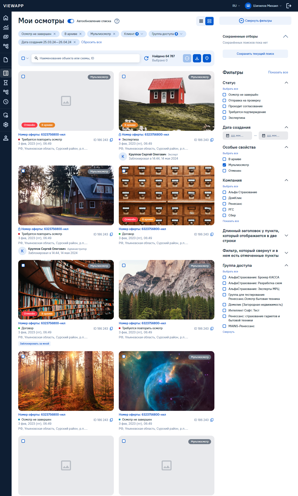 | 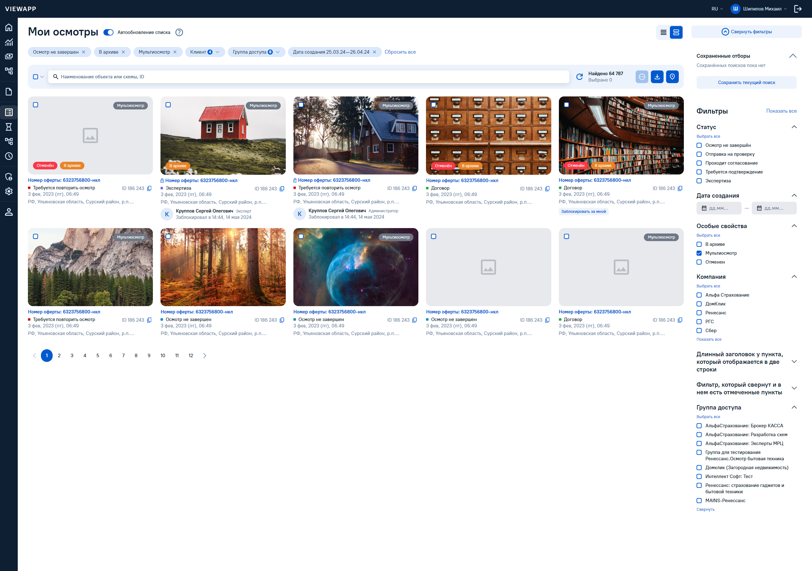 |

Снимки сняты headless-хромом с живой страницы на двух ширинах: 1440 — рабочая, 2560 — проверка
резиновой сетки. Обновляются командой (ширину подставить):

```bash
"/c/Program Files/Google/Chrome/Application/chrome.exe" --headless=new --hide-scrollbars --virtual-time-budget=9000 --window-size=1440,2300 --screenshot=docs/page-my-inspections-1440.png http://localhost:3000/my-inspections
```

Последний ряд карточек — без обложек намеренно: в макете он такой же, и на нём видно пустое
состояние `Image`.

## Что получилось в числах

| | Сколько |
|---|---|
| компонентов реестра на странице | **20** |
| композиций собрано без новых сущностей | **6** — тёмная шапка, рельс, шапка списка, панель действий, карточка осмотра, панель фильтров |
| новых компонентов заведено | **7** — `FilterChip`, `FilterPanel`, `FilterPanelSection`, `FilterPanelToggle`, `Table`, `TableCellText`, `TableFooter` |
| глифов добавлено в набор | 21 (штатным каналом: официальная выгрузка Material + `getBBox`) |
| расхождений всего | **57** |
| — (а) дефект сборки и компонента, исправлено | **37** |
| — (б) дыра системы, в долг | **20** |
| — (в) подозрение на устаревший макет | **3** |
| — решение владельца / система главнее макета | **12** |

Числа накопительные: девять дефектов и четыре решения владельца добавил такт 7, разбор — в конце
документа.

Хардкода нет: ни одного значения мимо токенов, ни одного нового цвета.

## Как читать наложение

Первый кадр — как есть. **Вся раскладка сдвинута влево на 28px**, и это одна дыра, а не сто:
рельс меню у Атома 56, в макете 84. Второй кадр компенсирует её дважды — рамка уже на 44, чтобы
гибкая колонка вернулась к 744, и сдвинута вправо на 28. Всё, что светится на втором кадре, к
рельсу отношения не имеет.

## (а) Дефекты сборки — исправлены

Двенадцать. Все мои; одиннадцать чинятся композицией, двенадцатый (заголовок карточки) потребовал нового вида у компонента.

| Что было | Замер | Причина | Как починено |
|---|---|---|---|
| заголовок уехал вниз | y 82 против 80 | центрировался по строке 44, а в макете прижат к верху | `self-start` |
| переключатель автообновления сдвинут | x 370 против 355 | сложились `gap-4` строки и `ml-4` на самом переключателе | убран `ml-4` |
| карточки одной высоты | 379 у обеих в паре | grid тянет элементы до высоты строки, в макете высоты разные (296 и 348) | `items-start` |
| зазор между статусом и датой | блок 48 против 40 | взял `gap-2` «на глаз» | зазора нет: в макете 40 при двух строках по 20 |
| у «Свернуть фильтры» пропала иконка | глифов 0 против 1 | слот иконки у `Button` рисуется **только при `show-icon`**; передал слот, а гейт не включил | добавлен `show-icon` |
| глифы переключателя вида | 24 против контура 18 в макете | размер брал по коробке пикты, а не по видимому контуру | 18 |
| глиф «скачать» | 20 против 16 | то же | 16, у соседей 20 и 19.3 |
| глиф «ещё» | голые точки против кружка с точками | взял `more_horiz` вместо `pending` | добавлен `pending`, контур 20×20 |
| ритм группы фильтров | 16 до первого пункта против 4 | сложились паддинг тела аккордеона и мой `pt-1` | ритм макета 4 / 8 / 8 |
| дыра между панелью действий и карточками | ~150px | сетка растягивала строки под высокую колонку фильтров | две колонки флексом |
| в поле даты фильтра два глифа | календарь и часы против одного календаря | у пикера Атома хвостовые часы стоят по умолчанию, я оставил дефолт | часы погашены слотом `#trailing` — компонент не тронут |

## (б) Дыры системы — в долг

Шестнадцать. Ни одна не дорисована на месте: страница собрана ближайшим системным способом,
расхождение оставлено видимым.

| Дыра | Замер расхождения | Ближайшее системное | Следствие на странице |
|---|---|---|---|
| **рельс меню 84 с подписями** | 56 против 84 | `Menu compact` | вся раскладка сдвинута на 28; гибкая колонка шире на 29 |
| подпись под иконкой в свёрнутом меню | нет вовсе | без подписей | рельс читается только по иконкам |
| **кнопка высотой 44** | 40 против 44 | `Button size="md"` | панель сохранённых отборов 148 против 152; блок из трёх кнопок 136 против 148 |
| **сегментированный контрол** | 48 против 44, активная плашка брендовая вместо белой | `Tabs variant="pill"` | переключатель вида выше на 4 |
| **иконка внутри `Badge`** | у Атома её нет вовсе | бейдж без иконки | три метки на обложке без пикт |
| **цвет `Badge` из расширенной палитры** | макет `#806aea` / `#c91826` / `#ff8552` | семантические роли `neutral` / `destructive` / `warning` | «Отменён» `#fa3948` вместо `#c91826`, «В архиве» `#e98326` вместо `#ff8552` |
| **пропорция обложки 9:5** | 360×200 в макете, ближайшее 16:10 даёт 360×225 | `Image ratio="16:10"` | +25 к высоте каждой карточки |
| выключенная кнопка гасится прозрачностью | макет `#80ace7`, у нас `#0059cf` на 32% | механизм Атома | иконочная кнопка «Ещё» светлее макета |
| подчёркивание ссылки рамкой 2px | строка 22 против 20 | `Hyperlink` как есть | +2 к высоте блока сведений |
| цвет ссылки | макет брендовый `#0059cf`, у нас `foreground-hover` `#003881` | `Hyperlink` как есть | номер оферты темнее |
| скроллбар страницы как элемент макета | 16px хром справа | нативный скроллбар | правый край страницы отличается |
| **правый слот у строки списка** | у мастера `ListItem` `2400:14661` правой части нет | заведён нашим слотом `#trailing` | без него крестик снятия некуда положить |
| **ширина `Popover` по содержимому** | меню режимов выбора требует 348, у мастера 320 | ширина задаётся числом | длинные пункты пришлось бы резать многоточием |
| **ступень 15/20 Bold у сервисной ссылки** | панельное «Показать все» 16/20 Regular против 15/20 Bold в макете | `ButtonAction size="md"` | у Атома ступени 16/20 и 13/16; 15/20 Bold — это `btn_txt` кита 1 |
| **ступень заголовка 15/20 у аккордеона** | 20/24 против 15/20; паддинг тела 12 против 4 | `Accordion size="sm"` плюс компенсация отступа в композиции | заголовки групп фильтров крупнее макетных |
| **пустое состояние `Image`** | у мастера Атома `174:3128` только пропорция — ни заливки, ни глифа | заглушка добавлена дефолтом в сам компонент, `@debt` | без неё карточка без обложки давала белую пустоту. Цвета нейтральные: `#e8e9ec` с глифом `#b9bec5` против брендово-голубых `#d9e8fc` и `#bcd4f5` у кита 1; глиф 48×48 против 60×48 — пропорция Material квадратная |

Итог по высоте карточки: **323 против 296** — из них 25 даёт пропорция обложки, 2 подчёркивание
ссылки. Остальное совпало.

## (в) Подозрение на устаревший макет — не чиним под макет

| Что | Замер | Почему считаем макет устаревшим |
|---|---|---|
| **зелёный статус `#008a25`** | в макете `#008a25`, в ките `#1bb149` | Это ровно то расхождение, что заведено в `figma-fixes.md` пунктом 1.1: файл дашборда сидит на **непринятом обновлении библиотеки**. Замер пикселя эталона подтвердил его прямо на странице. Чинить под макет нельзя — поедет вся рампа |
| кегль 14 в тёмной шапке | «RU» и имя пользователя набраны 14/20 | Кегля 14 в ките нет **ни одним стилем документа** — при этом им набраны 42 узла (`tokens.md`, раздел «Шкала»). Собрано на 15 |

## Демо-контент макета — оставлен намеренно

Отдельная категория: это не расхождение и не наш мусор, а **содержимое самого макета**, которое
дизайнер положил, чтобы показать поведение. Воспроизводим как есть и не считаем в трёх
категориях выше.

| Что | Где | Зачем в макете |
|---|---|---|
| группа «Длинный заголовок у пункта, который отображается в две строки» | панель фильтров | проверка переноса заголовка группы на две строки |
| группа «Фильтр, который свернут и в нем есть отмеченные пункты» | там же | проверка свёрнутого состояния с отметками внутри |
| «Найдено 64 787», «ID 186 243», один и тот же номер оферты у всех карточек | панель действий и карточки | демонстрационные числа. «Выбрано N» с правки 17 живое |

## Не расхождение: плашка со временем отрисовки

На живом скриншоте поверх фотографии висела плашка вроде «309 ms». Это **не наша разметка и не
макет**: так рисует трассировщик Vue из Nuxt DevTools — в DOM это `#vue-tracer-overlay` и
`#nuxt-devtools-container` рядом с `#__nuxt`, то есть чужие узлы поверх страницы.

Коллизии с чипом «Отменён» разводить не нужно — разводить нечего. DevTools выключены в
`nuxt.config.ts`, чтобы приёмочные снимки не собирали чужой хром; включаются обратно одной
строкой.

## Где цвет ждёт легенду

Правило: статусные плашки — `StatusBadge` с иллюстративной раскладкой, пока Михаил не даст
легенду. Помечены места, где выбор цвета сделан «по похожести», а не по правилу:

| Место | Сейчас | Ждёт |
|---|---|---|
| статус осмотра в карточке (6 значений) | `red` / `violet` / `green` / `cyan` по цвету в макете | легенду «статус → цвет» |
| метки на обложке: «Отменён», «В архиве», «Мультиосмотр» | семантические роли `Badge` | легенду плюс решение, берёт ли `Badge` палитру |
| буквенная метка `StatusLetter` | на странице не понадобилась | — |

## Что показал тест про сам кит

1. **Страница собралась целиком из реестра.** Ноль хардкода; новых компонентов на первом такте было ноль, дальше их завели три — все производные и все в реестре. Из
   семнадцати расхождений одиннадцать — это отсутствующие ступени и слоты уже существующих
   компонентов, а не отсутствующие компоненты.
2. **Половина расхождений — одна и та же граница «Атом против кита 1».** Рельс 84, кнопка 44,
   иконка в бейдже, цвет ссылки: везде кит 1 богаче, а основа у нас атомовская. Это не дефект
   переноса, а цена пивота, и она теперь измерена.
3. **Композиции работают.** Шесть композиций собраны без единой новой сущности — ровно так, как
   `Breadcrumb` собирается из `ButtonNavigation`. Правила записаны в `naming.md`.

## Правки Михаила по живой странице, 2026-08-18

Восемь пунктов ревью. Категории те же: **дефект сборки** чинится молча, **решение владельца**
уходит в `figma-fixes.md`, **системное правило** — в `naming.md`.

| № | Пункт | Категория | Что сделано |
|---|---|---|---|
| 1 | переключатель вида: иконки крупнее нужного | дефект сборки | замер эталона: коробка пикты 24, **видимый контур 18×16 и 18×18**. Глиф задан по контуру — было 24 |
| 2 | «скачать»: сверить размер глифа | дефект сборки | в макете контур **16×16**, у нас стоял 20 — уменьшен. Заодно сверены соседи: «ещё» 20×20, гео 16×19.3. **Глиф «ещё» оказался другим**: в макете `24_ic_pending` — кружок с точками, у нас были голые точки `more_horiz`; кружок добавлен в набор |
| 3 | убрать подложку чекбокса на превью | **решение владельца** | плашка 48×48 убрана, чекбокс стоит на фото с отступом 16. Запись — `figma-fixes.md`, «Сознательные отклонения» |
| 4 | резиновая сетка карточек | **решение владельца → системное правило** | `auto-fill` с минимумом 360 (габарит карточки в макете). Колонок: 2 при 1440, 3 при 1920, 5 при 2560. Правило «Ширину задаёт карточка, а не число колонок» — в `naming.md` |
| 5 | массовые действия: чекбокс + шеврон + выпадашка | системное правило | композиция из готового: чекбокс, кнопка-держатель 24 с шевроном 11 (замер эталона) и `Popover` со строками `SelectItem`. API `Checkbox` не тронут. Правило «Держатель рядом, а не проп внутри» — в `naming.md`. Состав пунктов пришёл из продукта правкой 17 |
| 6 | тултип у знака «?» | дефект сборки | текст **не демо**: нашёлся в макете, инстанс `Tooltip` `19512:17509` на кадре 1536 — «Список осмотров обновляется каждые 60 секунд» |
| 7 | наведение у всего интерактивного | **решение владельца → системное правило** | добавлено там, где мастер его не рисует: контрол выбора (`primary-hover`), иконочные кнопки `ghost` и `elevated`, карточка (тень `shadow-elevated`). Выбор «подсветка против тени» — по фону: на белой карточке подсветка не читается. Правило — в `naming.md`, запись — в `figma-fixes.md` |
| 8а | демо-данные в группах фильтров | дефект сборки | списки удлинены, отметки живые: «Показать все» и «Свернуть» реально режут список до пяти, у свёрнутой группы внутри отмеченные пункты |
| 8б | зазор «заголовок группы → пункты» | дефект сборки + дыра системы | ритм приведён к макетному (4 до «Выбрать все», 8 до пунктов, 8 между). Осталась дыра: у аккордеона ступени заголовка 24 и 20, в макете **15/20**, и паддинг тела 12 против 4 — компенсирован в композиции |

**Побочно найдено и исправлено:** сетка страницы растягивала строки под высокую колонку
фильтров, из-за чего между панелью действий и карточками зияли ~150px. Две колонки переведены на
флекс — координаты вернулись к макетным (шапка 80, панель 148, карточки 248).

## Такт правок 2, 2026-08-18

Принцип такта: **правка вносится в систему, страница только потребляет.** Ни одного
локального override — всё, что видно на странице, приехало из компонента, токена или правила.

| № | Пункт | Категория | Причина | Что изменено и где лежит |
|---|---|---|---|---|
| 9 | заголовок карточки потерял стиль | дефект сборки + дыра системы | взял `Hyperlink` как есть, а это ссылка **Атома**: подчёркивание слоем 2px и тёмный текст. Стиля заголовка карточки в реестре не было вовсе | заведён вид `variant="accent"` у `Hyperlink` по замеру `text_link` кита 1: 15/20 Bold, `--primary`, без подчёркивания. Подчёркивание снимается видом, а не на странице |
| 10 | ховер карточки | решение владельца | тень поднимала всю плитку; на сетке из десяти карточек это дребезг | тень убрана. Заголовок уходит в ховер ссылки, превью приближается на 1.04 за `--duration-zoom` (0.18s). Механика в компонентах: `Hyperlink` и `Image zoom` слушают группу `card`; страница ставит только `group/card`. Правило — `naming.md` |
| 11 | чекбокс тонет на тёмном фото | решение владельца, **переиграно правкой 11-б** | подложку убрали в такте 1, контур остался без опоры | заведён токен `--shadow-on-image` (светлый ореол 4px плюс мягкая тень), применяется пропом `Checkbox on-image`. Правило «Контрол поверх изображения» — `naming.md` |
| 12 | кнопка копирования ID без ховера | решение владельца | это была голая иконка, а не кнопка | заменена на `IconButton variant="ghost" size="sm"` — ховер приезжает из общего правила п.7 |
| 13 | иерархия заголовков панели перевёрнута | решение владельца | «Фильтры» стояли на 17, заголовки групп — на 20 (ступень аккордеона) | «Фильтры» подняты на 24, соседнюю ступень шкалы. Группы не тронуты. Новую ступень не заводил. Правило «Иерархия заголовков панели» — `naming.md` |
| 14 | пагинация статична | решение владельца | у стрелок ховера не было, у номеров он был только по цвету текста | стрелкам добавлен ховер (`--primary`), невыбранной таблетке — поверхность `--secondary`. Обе правки в компонентах `Pagination` и `Tabs`, то есть работают везде |
| 15 | буква в аватаре правее центра | дефект компонента | флексбокс центрирует **адванс** глифа, а у PT Root UI левый полуапрош почти нулевой, правый заметный. Замер `measureText` при 16px Bold: «К» адванс 10.16 при чернилах 11 (смещение +0.42), «М» +0.52, «А» +0.22, «И» +0.32, «Ш» −0.02 | `Avatar` центрирует **чернила**: сдвиг считается для конкретной буквы и кегля. Константа не годилась — она чинила «К» и ломала «Ш» |
| 16 | «Показать все» против «Выбрать все» | **проверка, не правка** | — | см. ниже |
| 17 | контент попапов | **факт из продукта** | строки были придуманы мной как демо-набор | подставлены продуктовые. Шеврон у чекбокса — режимы выбора (три пункта), кнопка «ещё» — массовые действия (три пункта). Композиция и компоненты правки 5 не тронуты; попап «ещё» собран той же парой `Popover` плюс `SelectItem` |

### Пункт 16: это два разных элемента, и различие задано макетом

Замер эталона:

| Где | В макете | У нас |
|---|---|---|
| «Показать все» — уровень панели, `btn_txt` в шапке `20304:54613` | **15/20 Bold** `#0059cf` | 16/20 Regular `#0059cf` |
| «Выбрать все» — уровень группы, `btn_txt` внутри `filter_checkbox` | **13/16 Regular** | 13/16 Regular ✓ |

Вывод: **разные по замыслу макета**, статус «по макету» — не баг сборки. Групповой совпал
точно. Панельный расходится на ступень и на начертание: у `ButtonAction` Атома ступени
16/20 и 13/16, а 15/20 Bold — это `btn_txt` кита 1. Строка (б) в таблице дыр.

### Попапы: контент продуктовый

| Режимы выбора | Массовые действия |
|---|---|
| 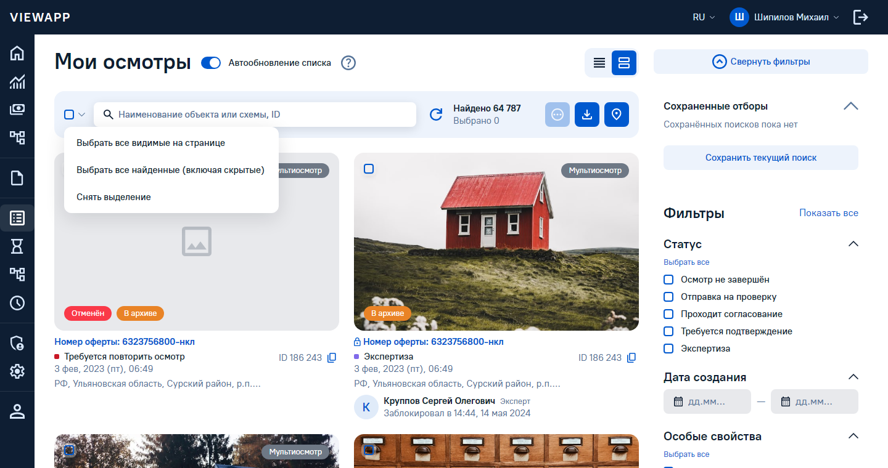 | 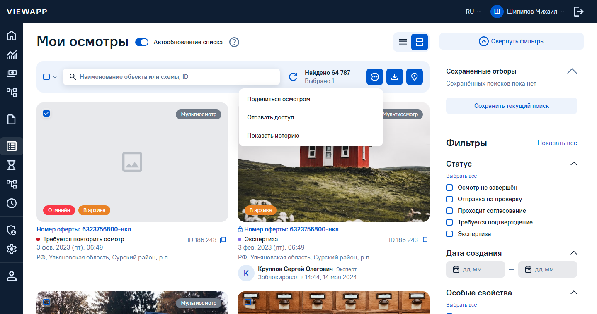 |

Снимаются с живой страницы теми же командами, что и полные скрины, с параметром
`?open=bulk` и `?open=more`. Параметр — демо-открывашка для приёмки:
headless-браузер снимает без кликов, а показать раскрытый попап надо. В продукте её не будет.

**Кнопка «ещё» выключена, пока ничего не выбрано** — так нарисовано в макете. Чтобы это было
правдой, а не картинкой, чекбоксы карточек стали живыми: они же питают счётчик «Выбрано N».

**Ширина меню 348, а не 320 из мастера.** Самая длинная строка — «Выбрать все найденные
(включая скрытые)» — требует 305 плюс паддинги. Ширины по содержимому у `Popover` нет:
ширина задаётся числом. Строка в дырах.
## Такт 3, правка 18: чипы применённых фильтров

Факт из продукта, состав по продуктовым скринам. Ряд стоит под шапкой страницы, над панелью
действий, и переносится на вторую строку сам.

| Ряд чипов | Раскрытый счётчиковый чип |
|---|---|
| 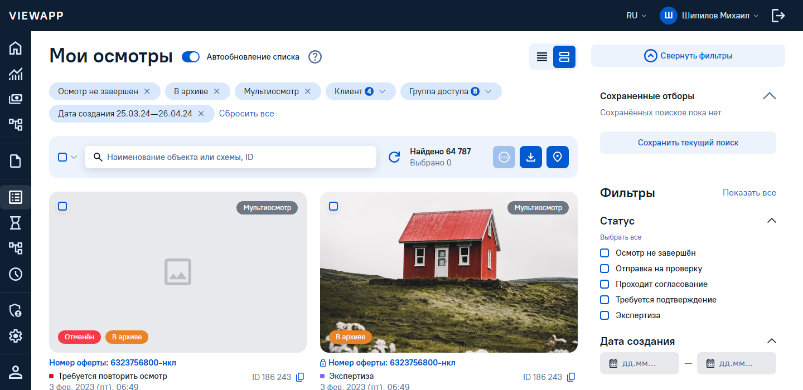 | 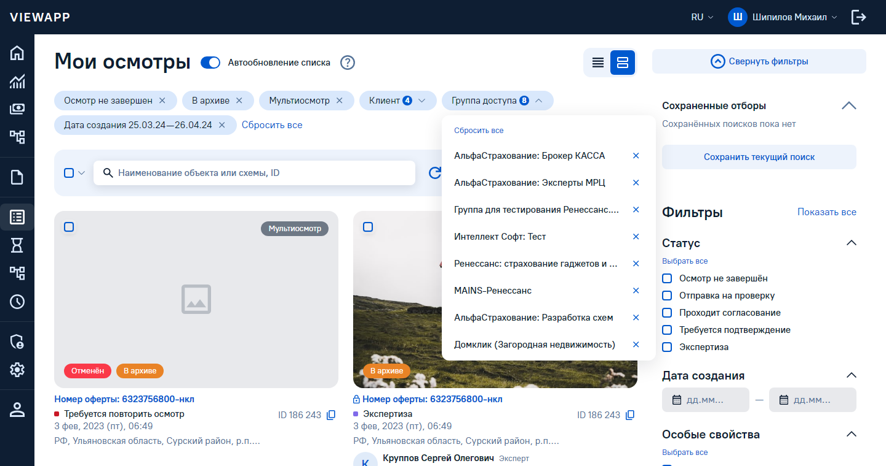 |

### Что заведено в реестре

| Что | Где | Что именно |
|---|---|---|
| `FilterChip` | `app/components/ui/filter-chip/` | производный компонент: пилюля плюс поповер со списком значений и сбросом. Вид выводится из данных — одно значение, диапазон или счётчик |
| ось хвостового контрола у `Chip` | `app/components/ui/chip/Chip.vue` | `trailing`: `remove` (крестик, как в мастере), `expand` (шеврон, поворачивается при раскрытии), `none`. Плюс эмит `toggle` и `aria-expanded` |
| хвостовой слот у `SelectItem` | `app/components/ui/select/SelectItem.vue` | строка списка получила правую часть под крестик снятия |

Внутри `FilterChip` — только реестр: `Chip`, `Popover`, `SelectItem`, `IconButton`, `ButtonAction`.
Ни одного своего цвета, радиуса или кегля; новых токенов не потребовалось.

### Живое поведение — проверено кликами

| Что проверял | Результат |
|---|---|
| раскрытие счётчикового чипа | поповер 348, сверху «Сбросить все», ниже 8 строк с крестиками, шеврон повёрнут |
| снятие одного значения | счётчик 8 → 7, строк в списке 8 → 7 |
| снятие одиночного чипа | чипов 6 → 5 |
| пустой фильтр | последнее снятое значение убирает чип целиком |

### Дыра, вскрытая правкой

У мастера `ListItem` `2400:14661` правой части нет вовсе — только чекбокс, левый
держатель и текст. Крестик снятия в строке значения пришлось завести **нашим** хвостовым
слотом. Просьба дизайнерам — отрисовать строку списка с правым слотом.
## Правка 11-б: видимость чекбокса переделана

Решение владельца от 2026-08-18 заменяет ореол из правки 11.

| Было | Стало |
|---|---|
| прозрачный контрол плюс светлое кольцо 4px | непрозрачная заливка `--field-elevated` у невыбранного плюс слабая тень-отрыв 1px |

Почему так вернее: читаемость держит **заливка**, а не свечение. Прозрачный контрол на тёмном
снимке исчезает целиком, и кольцо только обводит пустоту. Тень при этом осталась, но с другой
задачей — отделить белый контрол от **белого кадра**: снег, студийный фон, засвеченное небо.
Токен `--shadow-on-image` поэтому не удалён, а переопределён: было
`0 0 0 4px #ffffff52, 0 2px 8px 0 #0c101833`, стало `0 1px 2px 0 #0c10182e`.

Выбранное состояние не тронуто: заливка `primary` непрозрачна и читается сама.
Отдельной подложки под контролом нет — заливка на самом контроле, радиус и рамка родные.

| Тёмное фото | Светлое фото | Пёстрое фото |
|---|---|---|
| 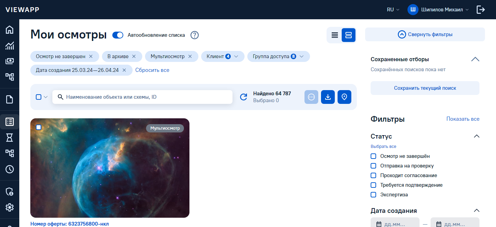 | 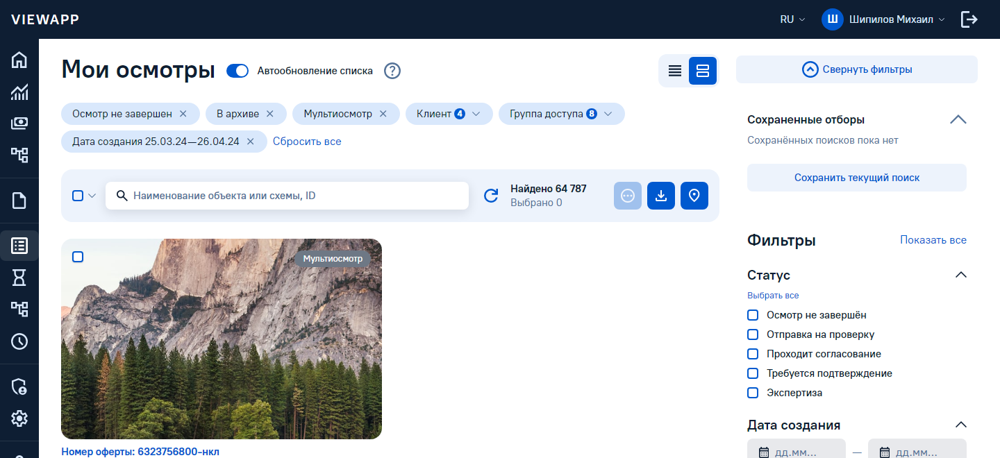 | 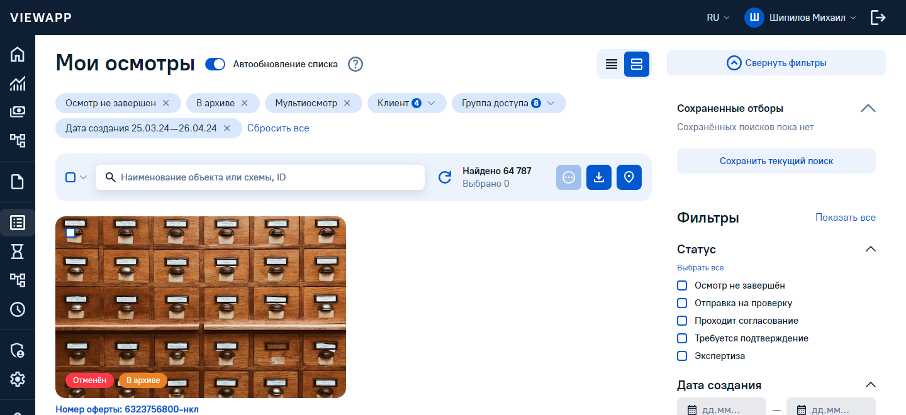 |

Снимки сняты с живой страницы параметром `?only=8`, `?only=6`, `?only=4` — он
оставляет в списке одну карточку. Это та же приёмочная оснастка, что `?open=`: headless
снимает страницу **от начала документа**, прокрутка ему недоступна, поэтому кадрировать
приходится не скроллом, а составом списка.
## Такт 4: табличный вид и свёрнутые фильтры

Эталон — кадр `19601:29029` («мои осмотры 1536+ 4», 1536×1525). На нём сразу оба
предмета такта: таблица и страница со свёрнутой панелью фильтров.

| Табличный вид 1440 | Табличный вид 2560 |
|---|---|
| 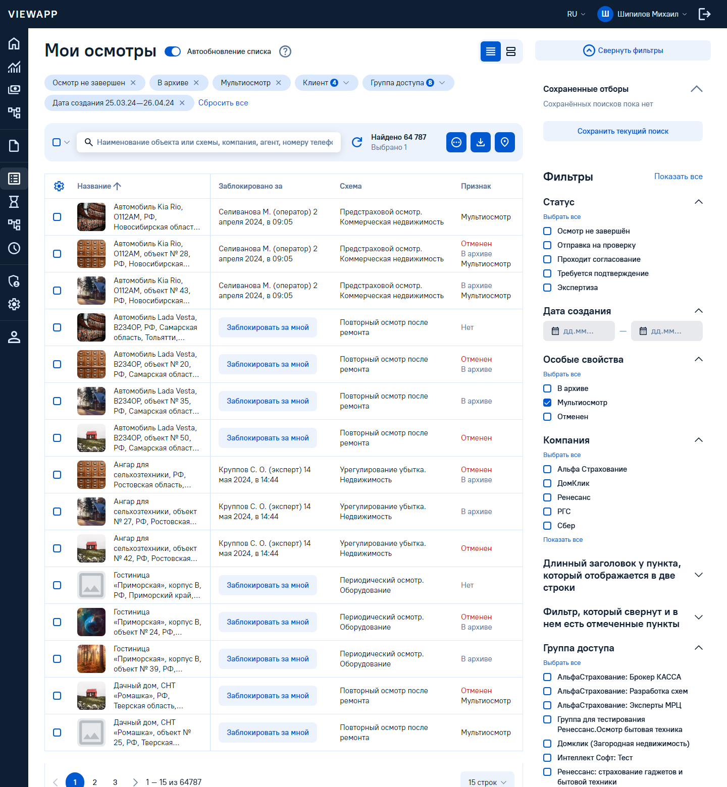 | 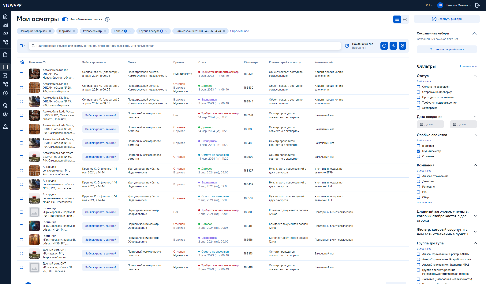 |

| Свёрнутые фильтры, плитка | Свёрнутые фильтры, таблица |
|---|---|
| 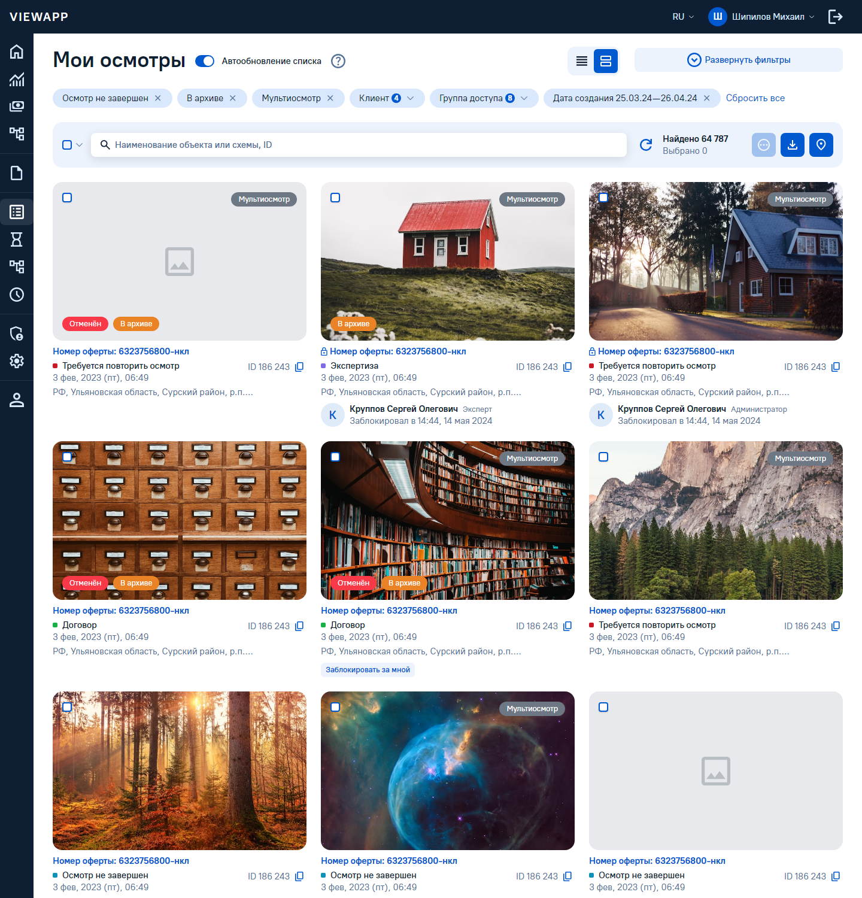 | 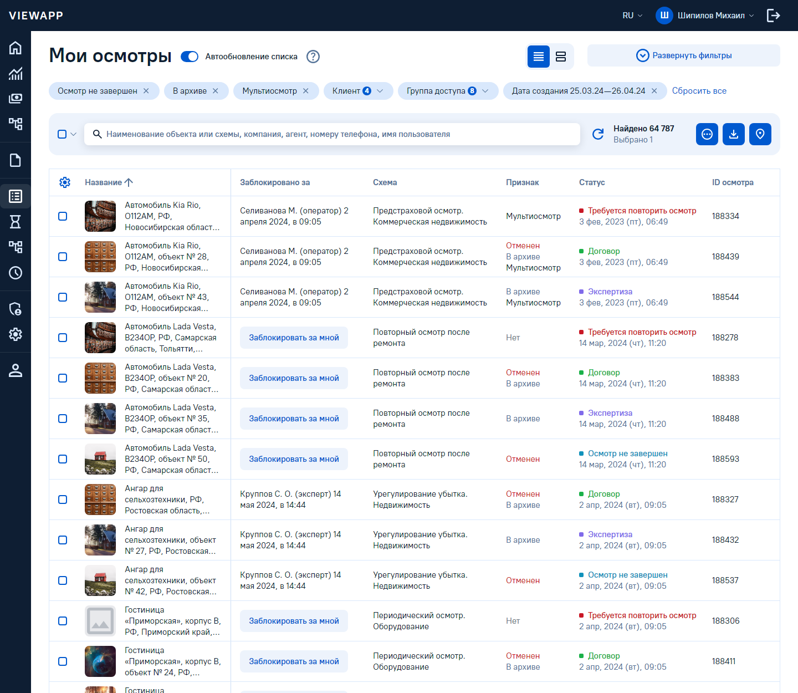 |

Контрольный снимок развёрнутой плитки — `page-my-inspections-1440.png` выше: она не сломалась.

### Что перенесено с макета

| Что | Значение с макета | В коде |
|---|---|---|
| колонки и порядок | чекбокс 32, Название 280, Заблокировано за 240, Схема 240, Признак 132, Статус 240, ID осмотра 132, Комментарий к осмотру 240, Комментарий 240 | ширины совпадают до пикселя, сумма 1776 |
| прокрутка | видимая область 1372 при содержимом 1776 | горизонтальный скролл |
| высота строки | 72 | `size="72"` |
| состояния строки | `Default`, `hover` `#f7f9fc`, `new` `#fff3ee`, `selected` `#edf3fc` | проп `state` у `TableRow`, заливки на существующих ролях |
| сортировка | стрелка `ic_sort_up` 16 у колонки «Название» | проп `sort` у `TableHead`, живая |
| настройка колонок | `24_settings` в шапке на месте чекбокса | иконочная кнопка |
| ячейка названия | превью 56 радиус 8 плюс две строки подписи | `Image` 56 плюс `line-clamp-2` |
| ячейка статуса | точка 8 радиус 2, подпись Medium, дата второй строкой | `StatusBadge` плюс дата |
| «Заблокировано за» | имя с ролью либо кнопка «Заблокировать за мной» | обе ветки |
| свёрнутые фильтры | панель исчезает, кнопка остаётся справа, подпись меняется, шеврон вниз | `FilterPanel` и `FilterPanelToggle` |
| ширина после сворачивания | таблица 1372 вместо 744 | таблица растягивается, плитка добирает колонки по `auto-fill` |

### Чего в макете нет — не изобретали

| Что | Как поступили |
|---|---|
| действия в строке: меню, кнопки на наведении | в макете их нет вовсе, не добавляли |
| второе направление сортировки | нарисована только стрелка вверх; вниз показываем поворотом того же глифа |
| поведение кнопки настройки колонок | не задано макетом: кнопка есть, действия нет |
| подписи у кнопок панели действий | на широком кадре у кнопок есть подписи «Экспорт в Excel» и «Показать на карте»; у нас они остались иконочными — панель общая для обоих видов. Расхождение записано |

### Компоненты, заведённые и расширенные

| Что | Где | Источник |
|---|---|---|
| `FilterPanel` и `FilterPanelToggle` | `app/components/ui/filter-panel/` | мастера нет ни в Атоме, ни в ките 1 — механика собрана по двум кадрам макета |
| проп `state` у `TableRow` | `table/TableRow.vue` | мастер `table_line` `19524:9679` кита 1 |
| проп `sort` у `TableHead` | `table/TableHead.vue` | `columns_name` `19601:29064` макета |
| слияние классов у `TableCell`, `TableHead`, `Image` | те же файлы | дефект: внешняя ширина не побеждала паддинг варианта |
| глифы `arrow-up` и `expand-circle-down` | `icon/icons.ts` | официальная выгрузка Material |

### Расхождения такта 4

| Что | Категория | Замер |
|---|---|---|
| ячейка-слот оборачивалась в `truncate` | **дефект компонента** | композиция в ячейке ломалась: превью и подпись вставали друг под друга |
| внешняя ширина не побеждала паддинг варианта | **дефект компонента** | чекбокс в колонке 32 обрезался паддингом 24 |
| шапка чекбокса 64 против 32 у ячейки | **дефект компонента** | шапка разъезжалась с телом на 32px |
| `Image` не принимал внешнюю ширину | **дефект компонента** | превью 56 расползалось на всю колонку |
| высота шапки таблицы 32 против 48 | **дыра системы** | у мастера Атома ступени 48 нет |
| подписи кнопок панели действий | **дыра системы** | не перенесены |
| подсветка строки: у Атома на ячейке, в макете на строке | **дыра системы** | заведён проп `state`, оба механизма сосуществуют |
## Такт 5: правки табличного вида

Сверка с тем же кадром `19601:29029`. Шесть пунктов, пять правок и одна проверка.

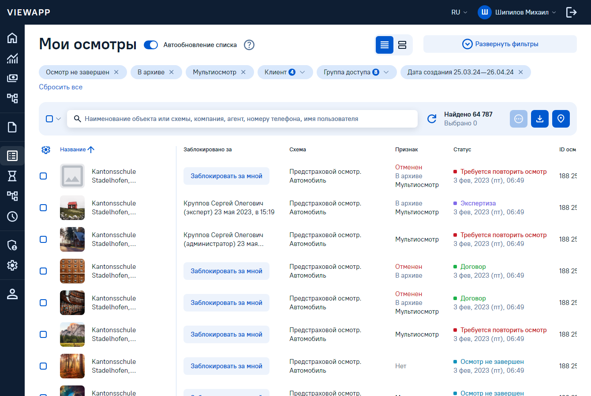

| № | Пункт | Категория | Причина | Где исправлено |
|---|---|---|---|---|
| 1 | цвет статуса | **дефект компонента** | цвет доставался только точке, подпись оставалась тёмной. В обоих макетах она цветная: в карточке «Экспертиза» 15 Medium `#806aea`, в строке «Требуется повторить осмотр» `#c91826` | `StatusBadge`: роль ушла на корень, точка берёт её через `bg-current`. Правка общая — карточка и таблица красятся одинаково |
| 2 | колонка «Признак» | **дефект сборки** | все значения красились одним приглушённым | тон каждого снят с ноды: «Отменен» `palette-06`, «В архиве» `fg/secondary`, «Мультиосмотр» основной текст, «Нет» `muted-foreground`. Карта тонов — в данных страницы, значения токенами |
| 3 | разделитель после «Названия» | **дефект сборки** | линии не было вовсе | **это граница закреплённой части**, см. ниже. Пропы `sticky` и `divider` у `TableCell` и `TableHead` |
| 4 | «Заблокировано за» | **дефект сборки** | дата блокировки не выводилась | в ноде это **одна строка**: «Ефремова А. (администратор групп) 23 мая 2023, в 15:19», 15 Regular `#0e1e33`. Демо-данные дополнены |
| 5 | фон строк | **проверка** | — | зебры нет и не было: `tableRowVariants` даёт белую строку по умолчанию. Заливка на снимке — **выбранная строка**, её ставит приёмочный параметр `?selected=2`. Ховер `#f7f9fc` и выбор `#edf3fc` — состояния мастера `table_line` |
| 6 | плейсхолдер поиска | **дефект сборки** | стоял текст из карточного кадра | с ноды: «Наименование объекта или схемы, компания, агент, номеру телефона, имя пользователя» |

### Пункт 3: это закрепление, а не просто линия

Ответ по ноде однозначный. В шапке лежат два фрейма: `fixed_columns` шириной 312 —
это чекбокс 32 плюс название 280 — и `columns_container` шириной 1464 рядом. Между ними
линия `devider` `#ccdef5` толщиной 1, идущая через шапку и все строки. Плюс у правого
края таблицы стоит `table_shadow` — признак того, что содержимое уезжает под край.

То есть левая часть **закреплена при горизонтальной прокрутке**, а линия — её правый край.
Так и сделано: две левые ячейки `sticky`, граница на правой из них. Проверено прокруткой —
при `scrollLeft = 400` колонка названия остаётся на месте, третья уезжает под неё.

**Закреплённая ячейка обязана быть непрозрачной**, иначе под ней просвечивает уезжающее
содержимое. Заливку она берёт у строки через `bg-inherit`, поэтому наведение и выбор
работают и на закреплённой части. Это, кстати, объясняет, почему у Атома заливка живёт на
ячейке: для закреплённых колонок иначе не собрать.

### Расхождения такта 5

| Что | Категория |
|---|---|
| подпись статуса не красилась цветом статуса | дефект компонента, исправлен |
| значения «Признака» одним цветом | дефект сборки, исправлен |
| нет границы и закрепления левых колонок | дефект сборки, исправлен |
| в «Заблокировано за» не было даты | дефект сборки, исправлен |
| плейсхолдер из другого кадра | дефект сборки, исправлен |
| **два разных плейсхолдера в двух кадрах макета** | подозрение на устаревший макет: в карточном кадре «…, ID», в табличном «…, компания, агент, номеру телефона, имя пользователя». Взят табличный, как просили |
## Такт 6: вторая итерация табличного вида

| Шапка с шестерёнкой | Подвал со счётчиком и переключателем |
|---|---|
| 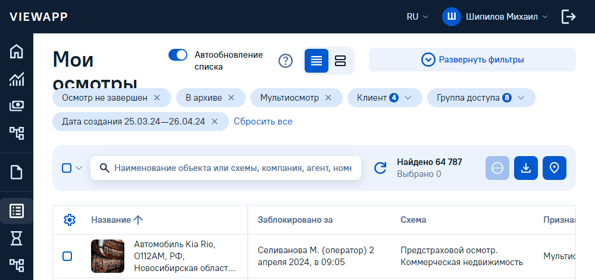 | 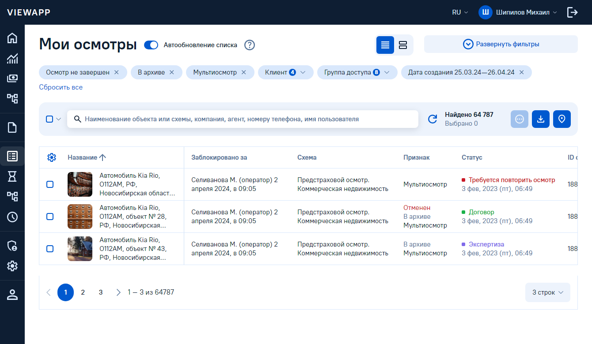 |

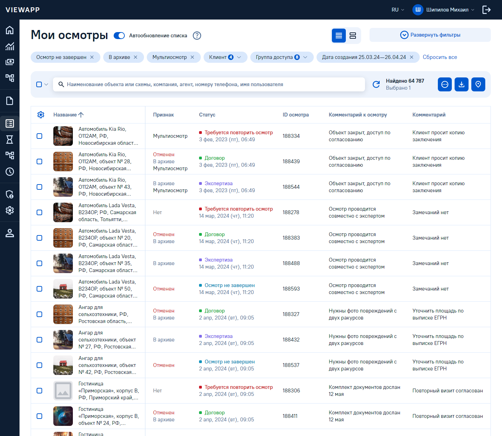

| № | Пункт | Категория | Причина | Где исправлено |
|---|---|---|---|---|
| 1 | стиль шапки | **дефект сборки** | заголовки стояли на атомовском варианте: 13, Medium, приглушённый. В ноде `columns_name` они **15 Bold `#567499`**, строка 48, белая заливка | вариант `column` у `tableHeadVariants` — типографика кита 1 рядом с атомовской, а не вместо |
| 1 | шестерёнка обрезалась | **дефект сборки** | стояла в 32-й колонке без запаса | колонка расширена до 48 с отступом 16, у кнопки свой бокс 24 |
| 2 | левый край | **дефект сборки** | чекбокс строки центрировался в 32-й колонке — 8 от края, а в панели поиска 16 | первая колонка получила `pl-4`: чекбоксы таблицы и панели на одной оси |
| 3 | рамка и разделители | **дефект сборки** | их не было вовсе | заведён токен `--border-soft` `#d9e8fc` (замер `table_content` и `table_line`). Рамка — в новом компоненте `Table`, разделитель строки — в `tableRowVariants`. ~~**Скругления в макете нет**~~ — **вывод неверен, исправлено тактом 7**: нулевой радиус у `table_content`, потому что он в середине контейнера `table` `19601:29061`; скруглены края контейнера, 16 |
| 4 | обрезание контента | **проверка** | — | замер после правок: у всех девяти заголовков `scrollWidth === clientWidth`, обрезки нет. Многоточие в ячейке названия — это `line-clamp` по макету: там текстовый узел 184×60, то есть **три** строки. Поставлено три |
| 5 | демо-данные | **дефект сборки** | таблица заполнялась клонами одной строки | набор на 50 осмотров: 15 объектов с адресами, 5 схем, 4 статуса, все сочетания признаков, обе ветки «Заблокировано за», разные ID, комментарии и даты. Плитка берёт первые десять того же набора |
| 6 | подвал | **недобор макета** | подвала не было, стояла голая пагинация | компонент `TableFooter` в реестре: пагинация слева, счётчик «1 – 15 из 64787», переключатель размера справа. Живой: меняет число строк и счётчик |
| 7 | закрепление | **проверка** | — | прокрутка на 600: закреплены ровно чекбокс, превью и название, граница на месте, остальные колонки уезжают под них. Закреплённые ячейки непрозрачны на белой, ховерной и выбранной строке — заливку берут у строки через `bg-inherit` |

### Побочно найдено и исправлено

**Пагинация показывала все страницы.** При 3 строках на странице их 21 596, и подвал
разъезжался в бесконечную ленту номеров. У `Pagination` появилось окно: три номера, как в
подвале макета, с текущей страницей в середине. Дефект компонента, не сборки.

### Решения сборки

| Что | Решение |
|---|---|
| значения размера страницы | раскрытого списка в макете нет — взяты **15 / 30 / 50**, как и договаривались |
| выравнивание первой колонки | в ноде чекбокс строки стоит на 128, а чекбокс панели на 132 — расходятся на 4px. Выровнено по панели: одна ось важнее буквального повторения |

### Не перенесено

| Что | Почему |
|---|---|
| `table_shadow` — тень у правого края таблицы | в ноде это отдельный узел-градиент 24 шириной, подсказка «содержимое продолжается». У нас закрепление уже показано границей; тень записана дырой, чтобы не выдумывать её геометрию |
## Как проверялось

| Проверка | Результат |
|---|---|
| наложение на эталон | `/compare`, первая секция: кадр «как есть» и кадр с компенсацией рельса |
| замер координат | все числа в таблицах выше сняты `getBoundingClientRect` внутри рамки шириной ровно 1280, а не на глаз |
| цвет | пиксельная выборка из эталона `getImageData` против computed-цвета сборки — так и вскрылся `#008a25` |
| автопроверка шрифтов | плитка 441 узел, таблица 674 — провалов нет |
| автопроверка оптики иконок | плитка 65 иконок, таблица 49 — провалов нет |

Автопроверки живут на `/compare` и обходят её собственный документ; страница лежит в рамке, то
есть в другом документе, поэтому по ней та же логика прогонялась отдельно. Это стоит завести
постоянно — строка в долге инструментов.

## Такт 7: правки по приёмке владельца

Сверка с теми же кадрами: карточный `20304:54594`, табличный `19601:29029`. Пять пунктов ревью,
девять правок и один дефект, который вскрылся по дороге и оказался крупнее всех пяти.

| Ховер кнопки обновления | Подсказка обрезанной ячейки |
|---|---|
| 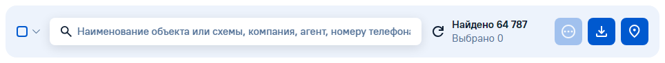 | 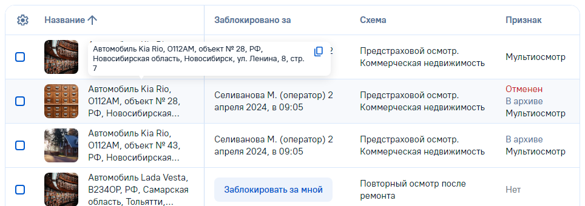 |

| Заголовок карточки | Блок «Сохраненные отборы» |
|---|---|
| 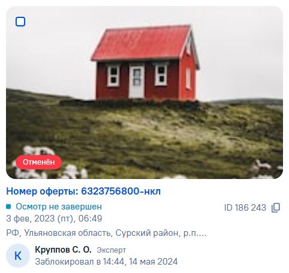 | 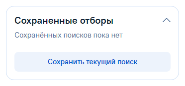 |

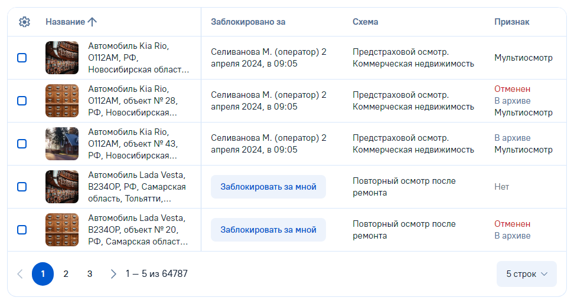

| № | Пункт | Категория | Причина | Где исправлено |
|---|---|---|---|---|
| 1 | шестерёнка и кнопка обновления | **дефект сборки** | шестерёнка была голым `<button>` с локальным классом и брендовым цветом, кнопка обновления стояла на `IconButton ghost` — у него глиф тоже брендовый. В макете обе — тот же `btn_service`, что и знак «?»: бокс 24, глиф `fg/secondary` `#567499` | новый тип `service` у `IconButton`; локальных стилей на странице не осталось |
| 1а | размеры глифов у этих кнопок | **дефект сборки** | брались на глаз: у обеих стояло 20 | замер видимого контура в макете: обновление 16×16, шестерёнка 17.997×**19**, подсказка 20×20 |
| 1б | знак «?» | **дефект сборки, побочно** | эталон сам был голой кнопкой с локальными классами | переведён на тот же `IconButton variant="service"`; вид не изменился, кроме глифа 24 → 20 по макету |
| 2 | подсказка полного содержимого у обрезанной ячейки | **решение владельца** | в макете это стикер дизайнера, нарисованного узла нет | компонент реестра `TableCellText`: сам замеряет обрезку и сам показывает плашку с полным текстом и кнопкой копирования. Механика таблицы, а не данные страницы |
| 2а | **`Tooltip` не открывался вообще** | **дефект компонента** | обёртка объявляла булевы пропы типами: Vue подставляет `false` вместо отсутствия, и `open: false` уводит примитив Reka в управляемый режим. Управляемая подсказка со значением `false` не открывается ничем | все булевы пропы `Tooltip` объявлены с `undefined` по умолчанию. Разбор — в шапке `Tooltip.vue` |
| 2б | `TooltipContent` не сливал внешний класс | **дефект компонента** | класс приклеивался, а не мержился — плашка не умела переносить длинный текст | `cn` плюс исключение `class` из `v-bind` |
| 2в | **`Dialog` с той же ловушкой** | **дефект компонента, побочно** | `open` и `modal` приходили в примитив как `false`: неуправляемое окно не открылось бы вовсе, а модальность молча терялась. На витрине не вылезло — там окна стоят с `:open="true"` | те же `undefined` по умолчанию |
| 3 | заголовок карточки крупнее | **решение владельца** | в макете 15/20 Bold, вровень с подписями вокруг | ступень `size="lg"` у `Hyperlink` — **16/20 Bold**, соседняя сверху в шкале кита. Новых ступеней не заводил |
| 4 | блок «Сохраненные отборы» | **дефект сборки** | обводка блока в сборке потерялась: блоки стояли на голой заливке | компонент `FilterPanelSection` — заливка, обводка `border/default` `#ccdef5`, радиус 16, паддинг 16 с мастера `saved_filter` `23952:86296`. Обводку получили **оба** блока колонки: экспорт кадра `20304:54610` показывает её у обоих |
| 4а | шеврон сворачивания | **дефект сборки** | стоял 24 против 16 у шевронов групп | 16, как у аккордеона |
| 4б | заголовок блока | **решение владельца** | в мастере он **17/24 Bold** — то есть сборка макету соответствовала | поднят на 20/24: иначе заголовок блока мельче заголовков групп в соседнем блоке. Отклонение от макета, запись в `figma-fixes.md` |
| 5 | скругление таблицы | **дефект сборки** | волна 7 сняла радиус с `table_content` `19601:29063` — у него он нулевой — и записала «скругления нет». Но `table_content` лежит **в середине** контейнера `table` `19601:29061`: скруглены его края, а не середина | верхние 16 у `Table`, нижние 16 у `TableFooter` |
| 5а | разрыв между таблицей и подвалом | **дефект сборки** | подвал стоял отдельным элементом колонки с зазором 24 | проп `attached`: подвал примыкает вплотную, рамка общая, вторая рамка на стыке не рисуется |
| 5б | верхний разрыв «панель поиска → таблица» | **решение владельца** | в макете панель поиска `table_header` `19601:29062` **входит в контейнер таблицы** и несёт её верхние 16 | разрыв оставлен: консистентность с карточным видом. Отклонение одобрено, запись в `figma-fixes.md` |

### Пункт 2а: почему это не поймали раньше

Подсказка стоит на странице с такта 1, текст к ней найден в макете, наложение сходилось — и всё
это время она **не открывалась ни разу**. Наложение сверяет вид, автопроверки — шрифты и оптику
глифов; поведение не проверяет ни одна из трёх.

Ловушка записана в `CLAUDE.md`: булев проп обёртки без `undefined` по умолчанию — это не
косметика, а переключение примитива в управляемый режим.

### Что заведено в реестре

| Что | Где | Источник |
|---|---|---|
| тип `service` у `IconButton` | `icon-button/index.ts` | `btn_service` кита 1, три инстанса в дашборде |
| `TableCellText` | `table/TableCellText.vue` | стикер макета плюс решение владельца |
| `FilterPanelSection` | `filter-panel/FilterPanelSection.vue` | мастер `saved_filter` `23952:86296` |
| ступень `lg` у `Hyperlink` | `hyperlink/index.ts` | решение владельца, ступень 16/20 из шкалы кита |
| проп `attached` у `Table` и `TableFooter` | `table/` | контейнер `table` `19601:29061` |

### Оснастка приёмки, добавленная тактом

`?open=tip` — раскрытая подсказка обрезанной ячейки. Тот же жанр, что `?open=bulk`: headless
снимает страницу без курсора. В продукт не идёт.

Снимок подсказки в документе снят **не** этим параметром, а настоящим наведением через CDP:
курсор наводится на ячейку, плашка появляется по своей задержке. Параметр остаётся для случаев,
когда наведение недоступно.

### Проверено после правок

| Проверка | Результат |
|---|---|
| автопроверка шрифтов | 361 текстовый узел, провалов нет (было 357 — счётчик вырос вместе с витриной) |
| автопроверка оптики иконок | 114 иконок, провалов нет |
| скругления и стык | у таблицы верхние 16, у подвала нижние 16, зазор между ними ровно 0 |
| сервисные кнопки | бокс 24 у всех трёх, цвет `#567499`, при наведении `#0e1e33` — замер под курсором, а не по классам |
| подсказка | открывается наведением, в плашке полный текст и кнопка копирования; у ячеек, где текст поместился, подсказки нет — из 103 обрезаны 15 |
