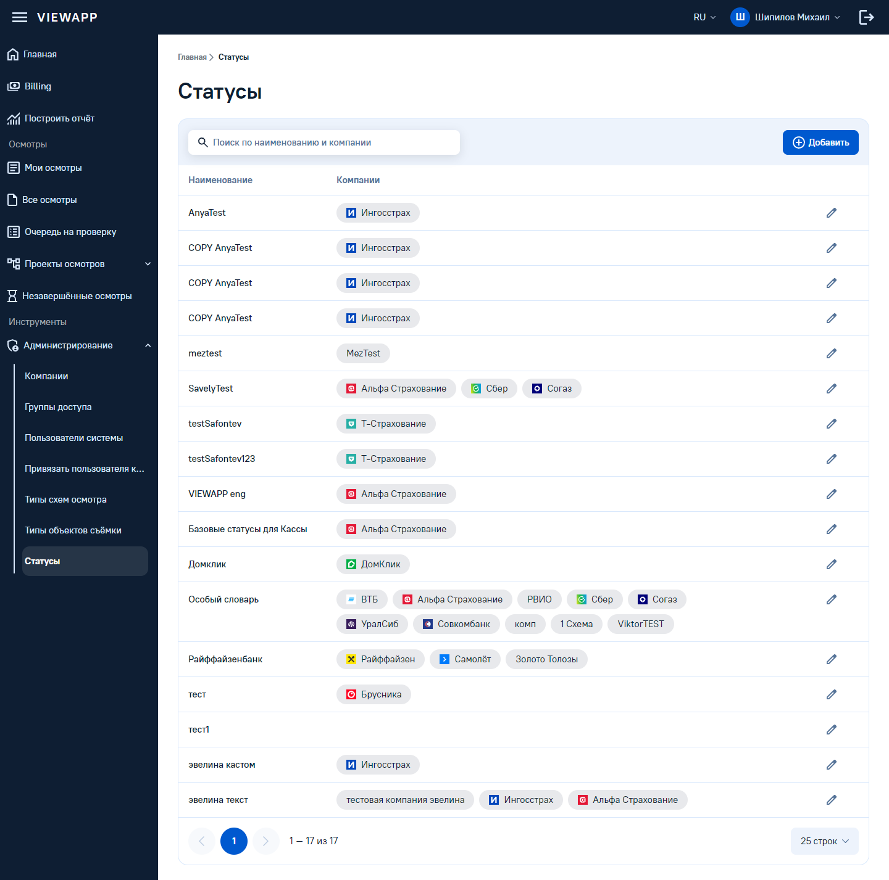
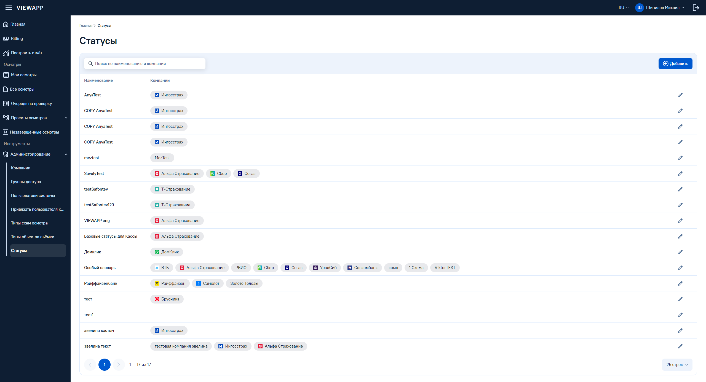
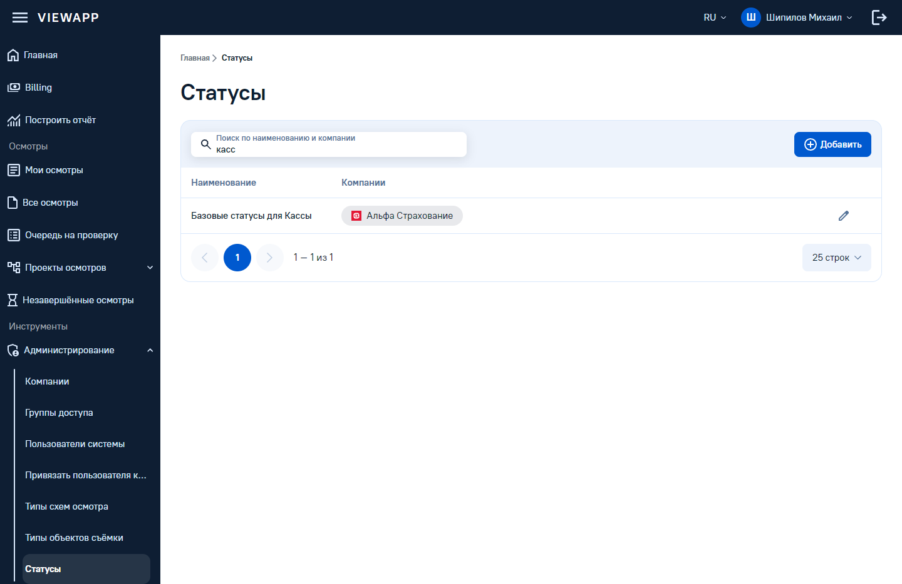
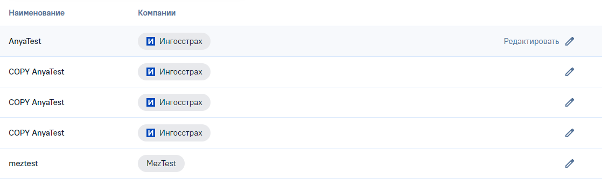
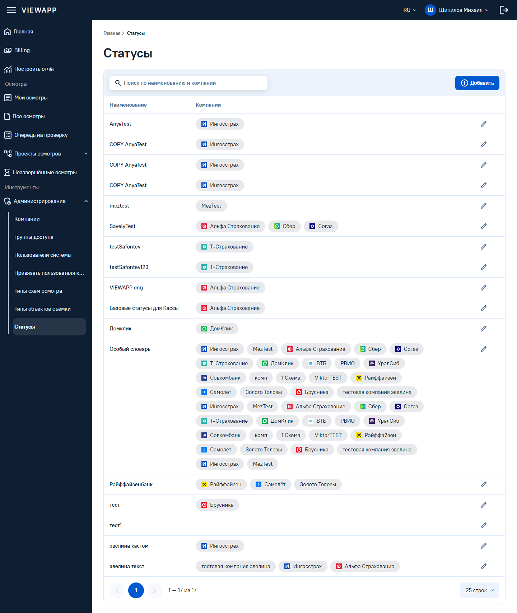
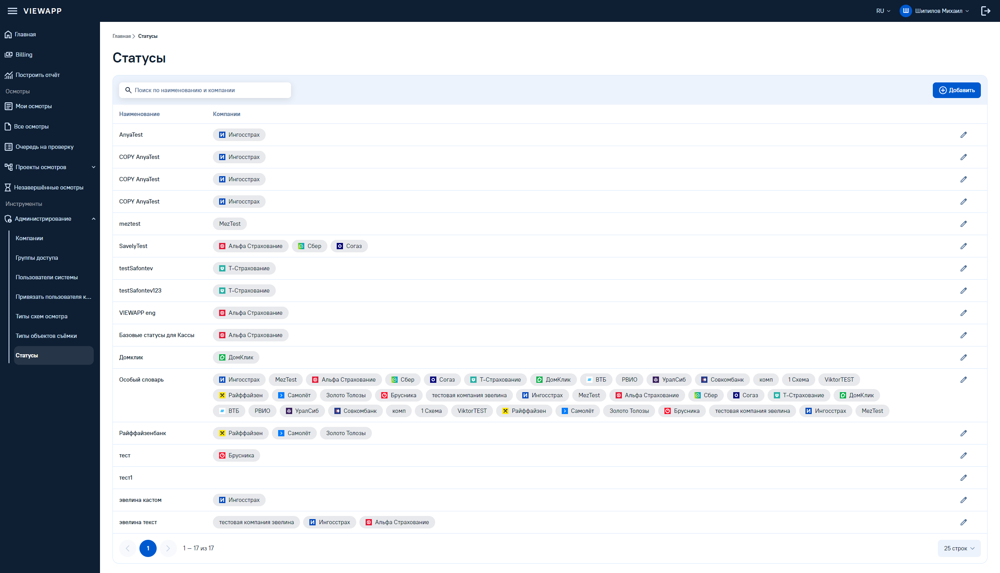

# Стенд «Статусы»

Собран 2026-09-15 тактом 24, правлен тактом 26 после приёмки владельца. Роут `/statuses`, каркас —
общий layout `admin`, пункт сайдбара «Администрирование → Статусы».

Список статусных моделей справочника по канону типовой страницы-таблицы (`docs/naming.md`, «Такт 20:
типовая страница-таблица админки (канон)» с правками тактов 21–26). Форма редактирования статусной
модели — блоки статусов, цвета, карта переходов, чек-лист компаний — отдельный стенд позже.

| 1440 | 2560 |
|---|---|
|  |  |

| Поиск «касс» | Наведение на строку |
|---|---|
|  |  |

| `?values=demo`, 1440 | `?values=demo`, 2560 |
|---|---|
|  |  |

## Источник

| Что | Откуда |
|---|---|
| состав страницы и данные | **прод**, страница «Статусы»: заголовок, «Добавить», таблица Наименование · Компании · «Изм»; компании столбиком, у части — логотип-картинка |
| макет | **нет** — в Figma страница не нарисована |
| вид | канон типовой страницы-таблицы; всё, что канон не покрывал, — решения владельца тактов 24 и 26 и решения сборки ниже |

Расхождения с продом дефектами не считаются: вид берётся из канона. В таблицу расхождений идут только
расхождения с мастерами ДС и решения, принятые сборкой за отсутствием мастера.

## Решения

| # | Что | Решение | Провенанс |
|---|---|---|---|
| A | страница и шапка | `/statuses` на `admin.vue`, активный пункт «Статусы», крошки «Главная › Статусы», заголовок «Статусы». Шапка по канону: поиск 440 слева «Поиск по наименованию и компании», «Добавить» справа, одна ось, без счётчика | решение владельца; канон такта 20 |
| B | колонки | Наименование · Компании · действия без заголовка (`TABLE_ROW_ACTIONS_COLUMN`). **Колонки Id нет** — у статусной модели нет идентификатора в системе | решение владельца; факт владельца (нет Id) |
| C | наименование | блок идентичности **без эмблемы**: `TableCellIdentity` без `icon`, имя 15/20 medium. Вес имени принят глазом, без замера (такт 26) | решение владельца; эмблема стала необязательной в компоненте |
| D | компании | многозначная ячейка `TableCell variant="values"`: метки инлайном с переносом, зазор 8, без потолка и без «+N»; порядок — как пришёл из данных | решение владельца, закрывает вопрос 34 вариантом (а); сознательное отклонение от референса Mobbin 6/6 |
| D | метка компании | **`Chip variant="neutral"`**: подложка `muted`, текст `foreground`, наведения, роли и `tabindex` нет; геометрия и типографика мастера `badge` `747:2464` — 32, радиус 24, паддинг 16, 15/20 Regular (такт 26) | решение владельца |
| D | мастер метки | статичный кандидат Атома `Badge` `913:8279` рассмотрен и отклонён: плашка поверх медиа (`Announcement`, `Slideshow`, `LightBox`), высота 16/24, кегль 10/13 вне шкалы кита. `ButtonTag` `256:3601` (`Tag`) — кнопка, прецедент такта 24 | решение владельца, такт 26 |
| D | логотипы | **изображение 16×16** в ведущем месте метки, проп `image`, `object-fit: contain`, `alt=""`; до подписи 8. Компания без знака — метка без изображения. Демо-знаки — trace-logos.ru, раздел «Логотипы» ниже (такт 26) | решение владельца: на проде это логотипы, загруженные компаниями; привязка брендов — рекомендация чата |
| D | пустой набор | пустая ячейка без «—», высота как у строки с одной меткой | решение сборки: прецедента пустой ячейки таблицы в «Моих осмотрах» нет |
| E | поиск | подстрока имени модели **или** любой её компании, без регистра, до пагинации, смена запроса сбрасывает страницу; совпавшие метки не подсвечиваются | решение владельца; правила канона |
| F | действия | **только карандаш**: подпись «Редактировать» по наведению → карандаш; правый слот 24×24 зарезервирован пустым. «Сделать копию» живёт в форме справочника. Клик по строке = редактирование, обработчиков нет намеренно | решение владельца, такт 26 (пункт F такта 24 снят); резерв слота — правило такта 22 |
| G | подвал | `TableFooter`: «1 – 17 из 17» при размере 25 | канон |
| H | оснастка | `?q=` и `?rows=` как на «Типах схем осмотров»; `?values=demo` — у «Особого словаря» 40 компаний по кругу из всех 19 имён демо-данных (такт 26) | решение владельца |
| I | выравнивание | в строке, которую растит «Компании», ячейки «Наименование» и действий стоят у первой линии меток: `TableCell align="start"`, высота 56 сохраняется | решение владельца, такт 26; канон `naming.md`, «E. Многозначная ячейка» |

**Вторичного действия на списке нет.** Такт 24 ставил «Сделать копию» в правый слот колонки действий;
такт 26 его снял: копия статусной модели — действие формы справочника. Правый слот остаётся
зарезервированным, карандаш стоит на X 1339 — как на «Типах схем осмотров» в том же окне. Глиф для
дублирования сущности на будущее — `file_copy` (`naming.md`, «Идентификатор со службой копирования»).

## Компоненты

### Переиспользовано без правки

`Breadcrumb`, `ButtonNavigation`, `TableToolbar`, `Input`, `Button`, `Icon`, `Table`, `TableRow`, `TableHead`,
`TableRowActions`, `TableRowAction`, `TableFooter`, `Menu`, `MenuSub`, `MenuItem`.

### Расширено тактом 24

| Что | Где | Зачем |
|---|---|---|
| `variant="values"` | `table/index.ts`, `tableCellVariants` | многозначная ячейка: перенос, зазор 8, высота растёт от минимума размера; `[contain:inline-size]` — иначе таблица распухала вбок |
| слот `leading` | `chip/Chip.vue` | ведущая иконка метки: у мастера `badge` `747:2464` слота нет; от подписи — корневой зазор мастера 8 |
| ось `interactive` | `chip/index.ts`, `chipVariants` | метка без действия (`trailing="none"`) не откликается на наведение |
| `icon` необязателен | `table/TableCellIdentity.vue` | блок идентичности без эмблемы — только имя, без пустого бокса |
| пункт «Статусы» подсвечивается | `layouts/admin.vue` | `:selected` по адресу `/statuses` |

### Расширено тактом 26

| Что | Где | Зачем |
|---|---|---|
| ось `variant: default \| neutral` | `chip/index.ts`, `chipVariants`; `chip/Chip.vue` | нейтральная метка значения: подложка `muted`, без наведения; `active`, `count`, `marker` и `trailing` у неё погашены, хвост всегда `none`. Заливки `default` переехали в compound по оси `variant` |
| проп `image` | `chip/Chip.vue` | логотип 16×16 `object-contain`, `alt=""`; занимает место слота `leading` |
| ось `align: stretch \| start` | `table/index.ts`, `tableCellVariants`; `table/TableCell.vue` | ячейка у первой линии многозначной: `self-start`, высота размера сохраняется |

Витрина не менялась: примеры `Chip` на ней идут на `variant="default"` по умолчанию, API расширен без
поломки.

## Демо-данные

Семнадцать статусных моделей с прода; порядок строк и порядок компаний внутри строки сохранены — алфавит на
проде не соблюдается, сортировка исказила бы данные. Названия моделей — с прода. Двенадцать компаний со
знаком переименованы тактом 26 в бренды своих знаков. «·» — компания без знака.

| # | Статусная модель | Компании |
|---|---|---|
| 1 | AnyaTest | Ингосстрах |
| 2–4 | COPY AnyaTest ×3 | Ингосстрах |
| 5 | meztest | MezTest· |
| 6 | SavelyTest | Альфа Страхование, Сбер, Согаз |
| 7 | testSafontev | Т-Страхование |
| 8 | testSafontev123 | Т-Страхование |
| 9 | VIEWAPP eng | Альфа Страхование |
| 10 | Базовые статусы для Кассы | Альфа Страхование |
| 11 | Домклик | ДомКлик |
| 12 | Особый словарь | ВТБ, Альфа Страхование, РВИО·, Сбер, Согаз, УралСиб, Совкомбанк, комп·, 1 Схема·, ViktorTEST· |
| 13 | Райффайзенбанк | Райффайзен, Самолёт, Золото Толозы· |
| 14 | тест | Брусника |
| 15 | тест1 | — пусто |
| 16 | эвелина кастом | Ингосстрах |
| 17 | эвелина текст | тестовая компания эвелина·, Ингосстрах, Альфа Страхование |

### Логотипы — компания → бренд → файл

Разделы каталога — «Страхование», «Банки», «Девелоперы и недвижимость»: по смыслу клиентов Рососмотра
(решение владельца). Привязка компания → бренд — рекомендация чата, сверена с каталогом: все двенадцать
файлов отвечают 200, `viewBox` квадратный. Читаемость в 16×16 проверена на зуме ×4 — замен нет.

| Компания в данных прода | Бренд | slug | Файл |
|---|---|---|---|
| AnyaTest | Ингосстрах | `ingosstrakh` | `public/demo/logos/ingosstrakh.svg` |
| Касса | Альфа Страхование | `alfa-insurance` | `public/demo/logos/alfa-insurance.svg` |
| Сбербанк страхование | Сбер | `sber` | `public/demo/logos/sber.svg` |
| Тестовая компания 2 | Согаз | `sogaz` | `public/demo/logos/sogaz.svg` |
| TestKasko | Т-Страхование | `t-bank-insurance` | `public/demo/logos/t-bank-insurance.svg` |
| Домклик | ДомКлик | `domclick` | `public/demo/logos/domclick.svg` |
| ВТБ Страхование | ВТБ | `vtb` | `public/demo/logos/vtb.svg` |
| Уралсиб | УралСиб | `uralsib` | `public/demo/logos/uralsib.svg` |
| Энергогарант | Совкомбанк | `sovcombank` | `public/demo/logos/sovcombank.svg` |
| Denis | Райффайзен | `raiffeisen` | `public/demo/logos/raiffeisen.svg` |
| Еж | Самолёт | `samolet` | `public/demo/logos/samolet.svg` |
| тест | Брусника | `brusnika` | `public/demo/logos/brusnika.svg` |

**Знаки принадлежат владельцам, демо-данные стенда; в прод и витрину не переносить.** Источник —
trace-logos.ru (каталог `https://trace-logos.ru/logos.json`), выгрузка 2026-09-15. Исключены по факту
каталога: «Сбер Бизнес» и «Почта Банк» — вместо знака `placeholder.svg`; «Сравни» — агрегатор, файл 150 КБ;
`dom-rf-bank-full` и `vtb-capital-full` — горизонтальные, соотношение 5.7 и 6.8.

## Таблица расхождений

| Что | Категория | Замер | Что сделано |
|---|---|---|---|
| **таблица распухала вбок, метки не переносились** | дефект компонента, исправлен | контейнер `Table` стоит на `min-w-max` и считал ячейку с переносом одной строкой: колонка «Компании» 1387 при окне 1440, карандаш на X 2047 — за экраном | заведён `TableCell variant="values"` с `[contain:inline-size]`: колонка 678, карандаш на X 1339 |
| **метка без действия откликалась на наведение** | дефект компонента, исправлен | у `Chip` наведение стояло на пилюле всегда, в том числе при `trailing="none"` | наведение переехало в ось `interactive`; у метки его нет — фон при наведении не меняется |
| **мастера нейтральной метки нет** | решение владельца | статичная метка Атома — `Badge` `913:8279`: плашка поверх медиа, 16/24, 10/13; `ButtonTag` `256:3601` — `<button>` с `aria-pressed` | `Chip variant="neutral"` на геометрии мастера `747:2464` (такт 26); до него — `Chip trailing="none"` (такт 24) |
| **у метки нет места под логотип** | дыра системы, закрыта | у мастера `badge` `747:2464` только маркер-точка; слот `icon` у `Chip` — хвостовой | такт 24 — слот `leading`; такт 26 — проп `image` 16×16; от подписи 8 — корневой зазор мастера |
| **метка наследует курсор строки** | решение сборки | задание: «курсор по умолчанию». Строка — цель клика, `cursor: pointer`; собственный `cursor: default` на метке разрывал бы цель: курсор менялся бы над меткой внутри кликабельной строки | своего курсора у метки нет; над меткой `pointer` в покое и при наведении, как над строкой |
| **пустой набор компаний — пустая ячейка без «—»** | решение сборки | прецедента пустой ячейки таблицы в «Моих осмотрах» нет | ячейка пустая, высота 56 — как у строки с одной меткой |
| **ширина «Наименования» 240** | решение сборки | самое длинное имя «Базовые статусы для Кассы» — 192.4 + паддинги 32 = 224 | 240: имя не обрезается, есть воздух |
| **«Особый словарь» при 1440 — две линии меток** | факт замера | такт 24: три линии (метки в сумме 1283, ячейка 678), принято владельцем по замеру. С брендами метки короче — две линии, строка 97. При 2560 — одна линия | принято тактом 24; число линий обновлено |
| **подвал при пустом результате — «1 – 0 из 0»** | дефект компонента, в долге | `TableFooter` при нуле записей начинает диапазон с 1, пустая таблица без сообщения | строка в `design-debt.md` (такт 24): пустое состояние через `Empty`; то же на «Типах схем осмотров» |

## Проверено

Такт 26. Курсор, замеры и снимки — headless Chrome через DevTools Protocol, окно 1440, как в тактах 20–24;
наведение — реальным движением курсора (`Input.dispatchMouseEvent`).

| Проверка | Результат |
|---|---|
| строки и подвал | 17 строк, «1 – 17 из 17»; строка `cursor: pointer` |
| колонки | Наименование 240 · Компании 678 · действия 200 |
| метка: шрифт подписи | computed `"PT Root UI"`, 15px, 20px, 400 |
| метка: вид | высота 32, радиус 24, паддинг 16; фон `rgb(232, 233, 236)` = значение `--muted`; `role` и `tabindex` нет |
| метка при реальном наведении | фон `rgb(232, 233, 236)` и курсор `pointer` — те же, что в покое; на наведённой строке (фон строки `rgb(247, 249, 252)`) метка сохраняет фон |
| изображение | 24 изображения на странице, все 16×16, `object-fit: contain`, `alt=""`; до изображения 16 от края метки, до подписи 8; незагруженных нет |
| файлы знаков | 12 запросов `/demo/logos/*.svg`, все 200 |
| компании без знака | MezTest, РВИО, комп, 1 Схема, ViktorTEST, Золото Толозы, тестовая компания эвелина — `` в метке нет |
| колонка действий | в каждой строке один глиф — карандаш, X **1339**; вторичный слот 24×24, детей нет; по наведению на строку подпись «Редактировать» видима |
| однострочная строка (AnyaTest) | высота 56 (57 с разделителем), ячейки 56 от верха строки; центры имени, метки и карандаша — **28** от верха: как до такта |
| `?values=demo`, 1440 | «Особый словарь»: 40 меток, 9 линий, зазор 8 по горизонтали и по вертикали, «+N» нет; строка 377. Центр имени **28**, центр первой метки **28**, центр карандаша при наведении **28** — дельта 0 |
| `?values=demo`, 2560 | 40 меток, 3 линии, строка 137; центры имени, первой метки и карандаша — **28** |
| поиск «касс» | 1 строка — «Базовые статусы для Кассы», «1 – 1 из 1» |
| поиск «anya» | 4 строки: AnyaTest, COPY AnyaTest ×3; «1 – 4 из 4» |
| поиск «ингосстрах» | 6 строк: AnyaTest, COPY AnyaTest ×3, эвелина кастом, эвелина текст; «1 – 6 из 6» |
| поиск «сбер» | 2 строки: SavelyTest, Особый словарь; «1 – 2 из 2» |
| поиск «касса» | 0 строк: слово «Кассы» подстроку «касса» не содержит. Число 1 в задании — ошибка счёта; кадр поиска снят на «касс» |
| hex, px, палитра | в `statuses.vue` и изменённых компонентах значений вне токенов нет; `palette-0` на стенде нет |
| `/compare` | 114 иконок, 361 текстовый узел, провалов нет |
| консоль и сервер | ошибок нет |

Выравнивание по первой линии держалось и до такта: у ячейки с заданной высотой `align-self: stretch`
работает как прижатие к верху строки. Ось `align="start"` делает это положение явным правилом ячейки.

## Референсы Mobbin

Перенесены из вопроса 34. Выборка — чата, решение — владельца.

### Многозначная ячейка

| Экран | Ссылка | Что показывает |
|---|---|---|
| Shopify | mobbin.com/screens/65e7ada9-b927-43b8-9d96-d9819026eed9 | многозначная ячейка в одну строку |
| Dovetail | mobbin.com/screens/832e5719-7133-4733-a7d2-87061364df60 | то же |
| Airtable | mobbin.com/screens/78b76ba8-be7a-4286-a991-abf82f444044 | то же |
| Juicebox | mobbin.com/screens/cbe1c32c-64a5-4017-b486-89563de632c0 | то же |
| Midday | mobbin.com/screens/975c0ea4-58a5-442e-bea9-cd42f360fd5d | то же |
| ClickUp | mobbin.com/screens/27113b60-6baf-4b1e-bd2c-3deebad34c58 | то же |

Счёт: одна строка **6 из 6**, перенос **0 из 6**. **Сознательное отклонение владельца:** метки переносятся,
потому что нужно видеть все компании набора сразу. На проде из 17 строк 12 с одной компанией, 3 с тремя,
1 с десятью, 1 пустая — перенос нужен редко, а «+N» прятал бы набор всегда.
