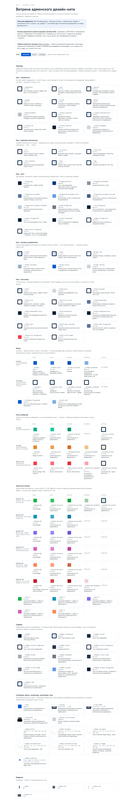

# Токены

Как устроен цвет и типографика кита 2 и как он соотносится с китом 1.
Этот файл переживает сессии: новая сессия видит `CLAUDE.md` и его, а не переписку.

---

## 1. Коллекции переменных в Figma

Файл кита: `uG3HTIcMwr2jI2d7YEYPs2` (`🖥️ UI Kit · Web Platform`).
Четыре локальные коллекции, все опубликованы, у всех один режим «Mode 1».

| Коллекция | Переменных | Статус | Как обращаемся |
|---|---|---|---|
| `theme(primitives)` | 254 | сырые значения, все скрыты от публикации | **не трогаем**, наружу не отдаются |
| `mode` | 69 | семантический слой, алиасит в primitives, CURRENT | **источник истины по цвету** |
| `menu` | 9 | отдельная коллекция под сайдбар | используем наравне с `mode` |
| `components` | 98 | легаси: алиасит во внешнюю библиотеку, 96 из 98 скрыты | **игнорируем полностью** |

Имена вида `bg/dark_default`, `fg/white`, `brand/default`, `fg/semi_bright` относятся к легаси-слою
`components`. В мапинг они не идут и в отчётах встречаться не должны.

## 2. Что откуда переносится

- **Цвет** — из Figma, коллекции `mode` + `menu`.
- **Типографика, радиусы, спейсинги** — code-first. Переменных под них в Figma нет и на этом
  этапе не будет; значения снимаются с фактических стилей компонентов. Шкала — в разделе 10.

## 3. Одна тема, светлая

Тем светло/темно в Figma нет — один режим, `mode` собран под светлую тему
(`bg/page` → neutral/0, `fg/primary` → neutral/990).

Делаем однотемный светлый набор. Тёмная тема появится позже отдельным модом в обеих коллекциях
независимо, поэтому структура заложена так, чтобы это было **переопределением значений в `.dark`**,
а не вторым набором имён.

## 4. Ловушки мапинга

### Ловушка 1 — `accent` значит разное

В shadcn `--accent` — это неяркая hover-поверхность, а брендовый цвет живёт в `--primary`.
У нас `accent/*` — это **бренд**.

Поэтому `accent/default` → `--primary`, а в shadcn-овский `--accent` идёт `accent/surface_soft`.

### Ловушка 2 — состояния не схлопываем

У нас около трёх десятков явных hover/pressed/disabled-переменных. shadcn базово состояния не
токенизирует и крутит прозрачность (`bg-primary/90`).

Прозрачность поверх подложки даёт **другой цвет**, поэтому схлопывание нарушило бы правило
«визуал не изобретать»: эти состояния нарисованы руками.

Решение: состояния выносятся **расширением темы** (`--primary-hover` и подобные). Расширения
живут внутри компонентов кита и на генерацию страниц не влияют — модель по-прежнему пишет
`<Button>`, а не утилиты состояний.

**Терять переменные молча нельзя.** Каждая переменная либо замаплена, либо попадает в список
«нет места» с причиной.

### Ловушка 3 — `card` и `popover` не имеют своих поверхностей

Отдельных поверхностей под card и popover в `mode` нет. Обе сажаются на `bg/page`; новых
переменных под них не выдумываем.

### Ловушка 4 — тема вне корня возвращает цвета, но не гарнитуру

`--font-sans` объявлялась только в `@theme`, то есть попадала на `:root`. Пока тема стоит на
корне страницы, этого хватает. Но `[data-theme="rososmotr"]`, вложенный **внутрь**
`[data-theme="atom"]`, переопределял цвета и не переопределял шрифт: `font-family` наследуется
уже вычисленным значением, и переопределение переменной ниже по дереву на него не влияет.

Так на `/compare` секции с эталонами кита 1 отрисовались в Golos Text — гарнитуре Атома. Подпись
чипа стала шире на 5px, и без автопроверки шрифтов это выглядело бы дефектом переноса.

Правила два:

1. **гарнитура объявляется в блоке каждой темы**, а не только в `@theme`;
2. **узел, меняющий тему, несёт класс `font-sans`** — иначе он продолжит наследовать вычисленное
   семейство сверху.

## 5. Коллекция `menu` — это сайдбар

`menu` описывает сайдбар. Он **тёмный при светлом остальном интерфейсе**, поэтому цвета вынесены
отдельно: сочетания там свои.

Это **не тёмная тема и не второй мод**. Сайдбар и контент видны одновременно, тема по-прежнему
одна — светлая. `menu` не сливается с `mode` в light/dark, `.dark` под сайдбар не заводится.

Целевое место — штатное пространство sidebar-токенов shadcn: `--sidebar`, `--sidebar-foreground`,
`--sidebar-primary`, `--sidebar-primary-foreground`, `--sidebar-accent`,
`--sidebar-accent-foreground`, `--sidebar-border`, `--sidebar-ring`. Они живут в `:root` наравне
со светлыми токенами.

> Проверено в нашей ревизии shadcn-vue: токен называется `--sidebar`, не `--sidebar-background`.

### Правило порталов

Внутри контейнера сайдбара легальны только `sidebar-*`-токены и их расширения. Всё, что вылетает
из сайдбара порталом — dropdown, tooltip, popover — живёт на обычных светлых токенах.
Выпадающая плашка светлая даже из тёмного меню.

### Принцип разведения состояний

Штатный слот shadcn получает то состояние, которое **стоковая разметка триггерит сама** — hover
приходит бесплатно из сгенерированного кода. Состояния, которые **явно прошивает наш код**
(active, selected), выносятся расширением и ставятся через data-атрибут внутри нашего компонента.

## 6. Расширенная палитра

`status-01`..`status-06` — **не статусы и вообще не семантика**. Это шесть дополнительных
цветовых рамп с состояниями, которые элементы берут по необходимости. Пример из кита: текстовая
кнопка, покрашенная в цвета шестой рампы.

Легенда «номер = статус» не нужна и невозможна: соответствия между номером и доменным смыслом
не существует.

**Имя `status-*` в код не тащим** — оно врёт о содержимом. Соответствие исходных имён Figma и
наших фиксируется в мапинг-таблице.

### Схема именования

Два варианта, оба сохраняют связь с китом через мапинг-таблицу:

| Вариант | Пример | За | Против |
|---|---|---|---|
| **по фактическому цвету** | `--palette-green-*`, `--palette-violet-*` | самоописывающее: «покрась в оранжевую рампу» ложится на имя напрямую; так устроены палитры Tailwind | если дизайнер перекрасит рампу, имя начнёт врать |
| по номеру | `--palette-01-*`..`--palette-06-*` | переживает перекраску, один-в-один с китом | так же непрозрачно, как `status-*`; для ИИ-сборки бесполезно |

Исходная рекомендация была «по фактическому цвету» — расширенную палитру берут по явному
указанию, а указание звучит как «в оранжевом». Сверка значений её отменила, итог ниже.

### Три исхода сверки значений

Схема выбирается не заранее, а по фактическим hex. Исход считается **для каждой рампы отдельно** —
одна может уйти в C, остальные жить по A или B.

| Исход | Условие | Что делаем |
|---|---|---|
| **A. Цветовые имена** | рампа не совпадает с семантикой | `--palette-green-*`, `--palette-violet-*` |
| **B. Номерные имена** | рампы близки к семантике, но не равны ей | `--palette-01-*`..`--palette-06-*` — два имени под похожие цвета собьют сборку |
| **C. Дубль семантики** | значения **буквально совпадают** с семантическим токеном | это не палитра, а дубль: рампа идёт в предложения дизайнерам на консолидацию, компоненты на ней мапятся на service-слой |

Последствие C на примере: красная текстовая кнопка — это не «кнопка шестой рампы», а
`variant="destructive"` на `service/error`. Компонент уходит в семантику, рампа в код не попадает.

### Результат сверки (2026-08-11)

Сравнение по фактическим hex из Figma:

| Рампа | hex рампы | Семантический сосед | hex семантики | Совпадение |
|---|---|---|---|---|
| `status-01` зелёная | `#1bb149` | `service/success-default` | `#00b288` | **нет** — трава против изумруда |
| `status-05` оранжевая | `#ff8552` | `service/warning-default` | `#e98326` | **нет** — коралл против охры |
| `status-06` красная | `#c91826` | `service/error-default` | `#fa3948` | **нет** — тёмный кармин против алого |

**Исход C не сработал ни для одной рампы.** Дублей семантики нет, консолидировать нечего,
все шесть рамп остаются палитрой.

### Принятая схема — номерная (исход B)

`--palette-01-*` … `--palette-06-*`.

Причина. Сверка вскрыла не два, а **три** цветовых пересечения с семантикой: зелёная, оранжевая
и красная рампы стоят рядом с `success`, `warning` и `error`. Значения разные, но **цветовое
слово одно и то же**. Цветовые имена дали бы `palette-green` рядом с семантическим `success` —
и на фразе «покрась в зелёный» сборка начала бы промахиваться ровно там, где цена ошибки выше
всего: на статусах успеха и ошибки.

Формально исход считается по каждой рампе, и для 02 (циан), 03 (фиолет), 04 (маджента)
пересечений нет — по букве правила они могли бы получить цветовые имена. Но смешанный набор
(`--palette-violet-*` рядом с `--palette-01-*`) хуже любого из двух однородных: правило
именования перестаёт быть выводимым. Поэтому номерная схема применяется ко всем шести.

Фактические цвета рамп зафиксированы в мапинг-таблице, чтобы номер можно было развернуть в цвет
не заглядывая в Figma.

### Правила употребления

1. **Дефолт при сборке страниц — семантические токены**: `accent`, `service/*`, `neutral`,
   `fg/*`, `bg/*`, `border/*`. Расширенная палитра в дефолт не входит.
2. **Расширенная палитра — только по явному указанию** макета или человека. «Похоже по цвету» —
   не основание.
3. Легальные употребления — по списку ниже. Он снят с кита, а не придуман.

### Легальные употребления

Снято полным обходом обоих файлов (~72 000 узлов, все 38 страниц кита и 2 страницы дашборда).
Всё, чего в списке нет, палитрой краситься не должно без отдельного решения.

| Рампа | Цвет | Где употребляется | Состояния |
|---|---|---|---|
| `status-01` | `#1bb149` зелёный | `bulb` / `Counter`, `iconed_tab_list` (через bulb), `status type=green`, `24_ic_check_circle` | default, hover, bg, disabled |
| `status-02` | `#1192bb` бирюзовый | только `status type=grey` — в самом ките не используется | default |
| `status-03` | `#806aea` фиолетовый | `badge color=violet`, `tag_platform_type type=web`, `status type=violet` | default |
| `status-04` | `#d461ba` маджента | **нигде** — только плашки на странице Colors | — |
| `status-05` | `#ff8552` оранжевый | `badge color=orange`, `tag_platform_type type=mobile` | default |
| `status-06` | `#c91826` красный | `btn_txt color=red`, `badge color=red`, `status type=red`, `attribute=yes` | default, pressed, disabled |

Компоненты, где цветовой дифференциации нет вовсе (проверено, пусто): `alert_*`, `left_menu`,
`user_card`, `saved_filter`, `select`, `multiselect`, `input`, `txt_area`, `checkbox`, `radiobtn`,
`switch`, `tabs`, `tool_tip`, `pagination`, `breadcrumbs`, `accordion`, `Popover`.

Наблюдения, важные для сборки:

- **Только `btn_txt` и `badge` имеют собственную покраску палитрой.** Попадания в `list_item`,
  `filter_checkbox`, `filter_date`, `table_line` — это вложенные экземпляры `btn_txt` и `status`;
  своего цвета эти компоненты не задают. В коде палитра нужна ровно двум компонентам.
- **Столбец «Состояния» выше — это употребление в компонентах, а не набор переменных.**
  Переменных в `mode` больше: у 02–05 есть `default`, `hover`, `pressed`; нет только `disabled`
  и `bg`. У 06 нет `bg`. Полный набор из пяти — только у 01. Прежняя формулировка «у 02–05 в ките
  один `default`» была ошибкой, поправлено сверкой такта 19 (раздел 11, Plugin API, 2026-09-15).
- **`status-04` не используется ничем.** Переносим ради полноты палитры, но в мапинг-таблице
  помечаем как неупотребляемую.

## 7. Мапинг-таблица

### Токены

**Все значения без исключения взяты из Figma** — ни одно не подобрано на глаз. Колонка
provenance описывает выбор **слота**: `прямой` — соответствие однозначно, `решение` — наш
выбор с обоснованием.

Полнота: 69 `mode` + 9 `menu` = **78 переменных, замаплены все 78**. Списка «нет места» нет —
он пуст. Непокрытых слотов shadcn нет.

#### Текст

| Figma | Значение | Слот | Provenance |
|---|---|---|---|
| `fg/primary` | `#0e1e33` | `--foreground`, `--card-foreground`, `--popover-foreground`, `--accent-foreground` | прямой |
| `fg/primary_hover` | `#003881` | `--foreground-hover` *(расш.)* | прямой |
| `fg/primary_disabled` | `#8b939e` | `--foreground-disabled` *(расш.)* | прямой |
| `fg/secondary` | `#567499` | `--foreground-secondary` *(расш.)* | прямой |
| `fg/secondary_hover` | `#669be2` | `--foreground-secondary-hover` *(расш.)*, `--sidebar-primary` | **решение** — см. вопрос 15 |
| `fg/secondary_pressed` | `#455f84` | `--foreground-secondary-pressed` *(расш.)* | прямой |
| `fg/secondary_disabled` | `#bccbe0` | `--foreground-secondary-disabled` *(расш.)* | прямой |
| `fg/default_on-accent` | `#ffffff` | `--primary-foreground` | прямой |

#### Поверхности

| Figma | Значение | Слот | Provenance |
|---|---|---|---|
| `bg/page` | `#ffffff` | `--background`, `--card`, `--popover` | **решение** — своих поверхностей у card и popover в ките нет, ловушка 3 |
| `bg/surface_hover` | `#f7f9fc` | `--accent` | **решение** — shadcn-овский `accent` это hover-поверхность, а не бренд; ловушка 1 |
| `bg/contrast` | `#0e1e33` | `--surface-contrast` *(расш.)* | прямой |
| `bg/disabled` | `#d0d4d8` | `--surface-disabled` *(расш.)* | прямой |
| `bg/surface_new` | `#fff3ee` | `--surface-new` *(расш.)* | прямой · имя `_new` предложено к переименованию |
| `bg/surface_selected` | `#edf3fc` | `--surface-selected` *(расш.)* | прямой |
| `bg/surface_hover_selected` | `#d9e8fc` | `--surface-selected-hover` *(расш.)* | прямой |
| `bg/overlay` | `#edf3fc80` | `--overlay` *(расш.)* | прямой |
| `bg/neutral_white40%` | `#ffffff66` | `--scrim-light` *(расш.)* | **решение** — процент в имени токена не тащим |
| `bg/neutral_black70%` | `#000000b2` | `--scrim-dark` *(расш.)* | **решение** — то же |

#### Бренд

| Figma | Значение | Слот | Provenance |
|---|---|---|---|
| `accent/default` | `#0059cf` | `--primary`, `--ring` | **решение** — ловушка 1: бренд идёт в `primary`, не в `accent` |
| `accent/hover` | `#337ad9` | `--primary-hover` *(расш.)* | прямой |
| `accent/pressed` | `#004eb5` | `--primary-pressed` *(расш.)* | прямой |
| `accent/disabled` | `#80ace7` | `--primary-disabled` *(расш.)* | прямой |
| `accent/surface_soft` | `#edf3fc` | `--secondary` | **решение** — фон `btn_secondary`, снят с узла |
| `accent/surface_bright` | `#d9e8fc` | `--secondary-hover` *(расш.)*, `--chip` *(расш.)* | **решение** — hover вторичной кнопки; вторым слотом заливка чипа в покое, см. ниже |
| `accent/surface_disabled` | `#f7f9fc` | `--secondary-disabled` *(расш.)* | прямой |

#### Границы и нейтральные

| Figma | Значение | Слот | Provenance |
|---|---|---|---|
| `border/default` | `#ccdef5` | `--border`, `--input` | прямой |
| `border/secondary` | `#9aacc2` | `--border-secondary` *(расш.)* · утилита `border-stroke-secondary` | прямой |
| `border/accent` | `#0059cf` | `--border-accent` *(расш.)* · утилита `border-stroke-accent` | прямой |
| `border/neutral_soft` | `#d0d4d8` | `--border-neutral` *(расш.)* · утилита `border-stroke-neutral` | прямой |

> **Ловушка имён: `border-border-*` не работает.**
> CSS-переменные называются `--border-accent` и т.д., но ключ Tailwind у них —
> `--color-stroke-accent`, поэтому в классах пишется `border-stroke-accent`, а не
> `border-border-accent`.
>
> Причина: в базовом слое стоит `* { @apply border-border }`. Утилита `border-border-accent`
> с ним конфликтует и **молча не генерируется** — класс висит на элементе, CSS-правила под него
> нет, рамка остаётся дефолтной. Отлавливается только проверкой вычисленного стиля, поэтому
> развели префиксы.
| `neutral/default` | `#6e7885` | `--muted-foreground` | прямой |
| `neutral/soft` | `#e8e9ec` | `--muted` | прямой |
| `neutral/disabled` | `#b9bec5` | `--muted-disabled` *(расш.)* | прямой |
| `secondary/default` | `#567499` | `--foreground-secondary` *(расш.)* | **дубль значения** `fg/secondary`, отдельного токена не заводим |
| `secondary/disabled` | `#bccbe0` | `--foreground-secondary-disabled` *(расш.)* | **дубль значения** `fg/secondary_disabled` |

#### Служебные

| Figma | Значение | Слот | Provenance |
|---|---|---|---|
| `service/error-default` | `#fa3948` | `--destructive` | прямой |
| `service/error-hover` | `#ff6874` | `--destructive-hover` *(расш.)* | прямой |
| `service/error-pressed` | `#e92837` | `--destructive-pressed` *(расш.)* | прямой |
| `service/error-surface` | `#fff0f1` | `--destructive-surface` *(расш.)* | прямой |
| `service/error-fg_disabled` | `#ff9fa6` | `--destructive-disabled` *(расш.)* | прямой |
| `service/warning-default` | `#e98326` | `--warning` *(расш.)* | **решение** — своего слота в shadcn нет |
| `service/warning-hover` | `#ed9e4a` | `--warning-hover` *(расш.)* | прямой |
| `service/warning-pressed` | `#da6a1c` | `--warning-pressed` *(расш.)* | прямой |
| `service/warning-surface` | `#fcefd8` | `--warning-surface` *(расш.)* | прямой |
| `service/warning-disabled` | `#f3c27e` | `--warning-disabled` *(расш.)* | прямой |
| `service/success-default` | `#00b288` | `--success` *(расш.)* | **решение** — своего слота в shadcn нет |
| `service/success-hover` | `#14cba3` | `--success-hover` *(расш.)* | прямой |
| `service/success-pressed` | `#009774` | `--success-pressed` *(расш.)* | прямой |
| `service/success-surface` | `#e6f7f3` | `--success-surface` *(расш.)* | прямой |

#### Расширенная палитра

Имя `status-*` в код не переносится — схема номерная, обоснование в разделе 6.
Суффикс `bg` в ките переименован в `surface` ради единообразия с `service/*-surface`.

| Figma | Значение | Слот | Provenance |
|---|---|---|---|
| `status-01/default` `/hover` `/pressed` `/bg` `/disabled` | `#1bb149` `#2fc55d` `#11a73f` `#d1ead9` `#a1cda1` | `--palette-01` + `-hover` `-pressed` `-surface` `-disabled` | **решение** — переименование, разбор в разделе 6 |
| `status-02/default` `/hover` `/pressed` | `#1192bb` `#41a8c9` `#0e7c9f` | `--palette-02` + `-hover` `-pressed` | то же |
| `status-03/default` `/hover` `/pressed` | `#806aea` `#9287f2` `#724edd` | `--palette-03` + `-hover` `-pressed` | то же |
| `status-04/default` `/hover` `/pressed` | `#d461ba` `#e185cf` `#c0429d` | `--palette-04` + `-hover` `-pressed` | то же · рампа не используется ничем |
| `status-05/default` `/hover` `/pressed` | `#ff8552` `#ff9d75` `#cc6a42` | `--palette-05` + `-hover` `-pressed` | то же |
| `status-06/default` `/hover` `/pressed` `/disabled` | `#c91826` `#d44651` `#a1131e` `#f4d1d4` | `--palette-06` + `-hover` `-pressed` `-disabled` | то же |

#### Сайдбар — коллекция `menu`

Принцип разведения: штатный слот получает состояние, которое стоковая разметка триггерит сама
(hover); состояние, которое прошивает наш код (activ), уходит в расширение.

| Figma | Значение | Слот | Provenance |
|---|---|---|---|
| `menu/bg/default` | `#0e1e33` | `--sidebar`, `--sidebar-primary-foreground` | прямой · для foreground — **решение**, контраст 5.9:1 |
| `menu/bg/layer_hover` | `#1a293d` | `--sidebar-accent` | **решение** — hover приходит из стоковой разметки даром |
| `menu/bg/layer_activ` | `#263547` | `--sidebar-active` *(расш.)* | **решение** — activ ставит наш код, через data-атрибут |
| `menu/fg/default` | `#d9e8fc` | `--sidebar-foreground`, `--sidebar-ring` | прямой · для ring — **решение**, контраст 13.5:1 |
| `menu/fg/activ` | `#ffffff` | `--sidebar-accent-foreground`, `--sidebar-active-foreground` *(расш.)* | прямой |
| `menu/fg/disabled` | `#6e7885` | `--sidebar-disabled` *(расш.)* | **решение** — штатного слота нет |
| `menu/devider/default` | `#a2a9b2` | `--sidebar-border` | прямой · опечатка `devider` в код не переносится |
| `menu/scroll/bg` | `#223247` | `--sidebar-scroll-track` *(расш.)* | **решение** — штатного слота нет |
| `menu/scroll/fg` | `#6e7885` | `--sidebar-scroll-thumb` *(расш.)* | **решение** — штатного слота нет · дубль значения `menu/fg/disabled` |

#### Слоты shadcn, закрытые не из `mode`/`menu`

| Слот | Чем закрыт | Provenance |
|---|---|---|
| `--chart-1` … `--chart-5` | `--palette-01` … `--palette-05` | **решение** — графики категориальны и семантики не несут, палитра ложится точно |
| `--radius` | `8px` — `btn/accent/radius`, `input/border`, `pag_btn/border` | из файла, code-first |
| `--radius-sm/md/lg/xl` | `4 / 8 / 12 / 16` | **решение** — формула shadcn `calc(±4px)` даёт 6px, которого в ките нет |
| `--font-sans` | `PT Root UI` | из файла, code-first |

#### Проверки приёмки

| Проверка | Результат |
|---|---|
| Двусторонняя полнота | 78/78 переменных замаплены; список «нет места» пуст; непокрытых слотов shadcn нет |
| Provenance на каждой строке | да; значения все до одного из Figma, колонка описывает выбор слота |
| Легаси не просочилось | `bg/dark_default`, `fg/white`, `brand/default`, `fg/semi_bright` в отчёте отсутствуют. Дополнительно: коллекции `components` и `theme(primitives)` не опубликованы в библиотеку, поэтому в поиск не попадают структурно |

### Компоненты и варианты

Заполняется по мере переноса. Колонка provenance: `из файла` — имя или значение взято из Figma,
`решение` — придумано нами.

| В ките 1 | В коде | Provenance | Основание |
|---|---|---|---|
| `btn_accent` | `Button variant="default"` | решение | канонический shadcn при наличии прямого аналога |
| `btn_secondary` | `Button variant="secondary"` | решение | то же |
| `btn_outline` | `Button variant="outline"` | решение | то же |
| `btn_txt` | `Button variant="ghost"` | решение | то же |
| `btn_remove` | `Button variant="destructive"` | решение | то же |
| `btn_back`, `btn_map`, `page_btn`, `collapsed_btn` | **не варианты Button** | решение | `variant` — это стиль, а не место использования; `page_btn` — внутренность Pagination |
| `badge` `1173:196` (24px) | `Badge` | из файла | декоративная статусная метка |
| `badge` `747:2464` (32px) | `Chip` | решение | другой компонент под тем же именем: счётчик + крестик, интерактивный |
| `range_slider` `2034:5889` | `Slider` | из файла | мастер жив, 75×4; атомовский `Fader` `635:5430` пуст |
| `ModalWindow` `6626:56959` (Атом) | `Dialog` | **композиция** | мастера нет; поверхность легла на новую роль `--dialog` |
| `LightBox` `8867:69956` (Атом) | `Lightbox` | **композиция** | та же поверхность `--dialog` |
| `_BulbStatus` `5862:53423` (Атом) | `StatusLetter` | решение | «лампочка» ничего не говорит о роли; это буквенная метка статуса в ячейке |
| `status type=green` | `variant="green"` | из файла | `status-01` `#1bb149` |
| `status type=grey` | `variant="cyan"` | **решение** | имя в ките ошибочно: фактический цвет `status-02` `#1192bb` |
| `status type=violet` | `variant="violet"` | из файла | `status-03` `#806aea` |
| `status type=red` | `variant="red"` | из файла | `status-06` `#c91826` |
| `select` `1929:4067` | `Select` | из файла | актуальный сет, 2026-06-24 |
| `select` `244:13976` | — не переносим | решение | предыдущее поколение, 2026-01-23 |
| `table_header` | `TableHeader` | из файла | актуальнее `TableHeader` из 2024 |
| иконки `24_ic_*`, `16ic_*`, `ic_*NN` | `Icon name="…" size` | решение | четыре конвенции в ките сводятся к одной |

> Имена вариантов `status` — цветовые, в отличие от токенов палитры, которые номерные
> (`--palette-02-*`). Это не разнобой: вариант компонента человек выбирает глазами по цвету,
> а токен подставляет сборка, где цветовое слово путалось бы с семантикой. Развод намеренный.

### Select: роль в мастере → токен `mode`

Мастер `select` `244:13976` покрашен коллекцией **`select/color/*`**, которой нет среди 78
перенесённых переменных, и ни одно её значение не совпадает с `mode`. Принято решение
(вариант B): **матрица, геометрия и раскладки — с мастера, цвет целиком из `mode`**;
`select/color/*` в код не входит.

Провенанс всей таблицы — **решение**. Причина и альтернативы:
[open-questions.md](open-questions.md), вопросы 21 и 22.

| Роль в мастере | `select/color/*` | В коде из `mode` | Обоснование |
|---|---|---|---|
| фон тела, все состояния | `#f6f6f8` | `bg/page` `#ffffff` | в `mode` нет серой поверхности поля |
| фон тела, disabled | `#f9fafb` | `bg/page` `#ffffff` | как у `input`: фон не сереет, гаснут цвета |
| **граница покоя** | рамки нет — различимость даёт серый фон | `border/default` `#ccdef5` | на белом фоне поле без рамки исчезает. Кит выражает ту же различимость рамкой — так устроен `input` |
| граница hovered / pressed / edit | `#93c5fd` | `border/accent` `#0059cf` | активная граница кита |
| граница disabled | нет | `border/neutral_soft` `#d0d4d8` | как у `input` |
| текст плейсхолдера | `#858fa3` | `fg/secondary` `#567499` | |
| текст значения | `#3a4760` | `fg/primary` `#0e1e33` | |
| подпись | `#1d222a` | `fg/primary` `#0e1e33` | |
| подсказка и счётчик | `#3a4760` / `#293244` | `fg/primary` `#0e1e33` | два разных значения роли схлопнуты в одно: разделение в `mode` не выражено |
| всё в disabled | `#a1a9b8` | `fg/primary_disabled` `#8b939e` | |
| **иконки** | `#000000` литерально, без переменной | `fg/secondary` `#567499`, в disabled → `fg/secondary_disabled` `#bccbe0` | чёрного в палитре кита нет; поведение взято у `input`, где иконки гаснут |

Геометрия при этом с мастера без изменений: высота тела 40, паддинги 8/16, радиус 8, gap 8,
контейнер с gap 4, подсказка 16, подпись фиксированной высоты 40. Подсказка и счётчик —
**Bold 13/16**, в отличие от `input`, где подсказка Regular. Так в мастере.

Выпадашка — семейство **`dropdown_list3` `240:8201`** со строками **`items3` `238:7389`**
(высота 36), а не `dropdown_list` / `items` (52): у выбранного мастера своё семейство.

## 8. Лог решений

| Дата | Решение | Основание |
|---|---|---|
| 2026-08-11 | Tailwind v4, CSS-first | токены живут как нативные CSS-переменные |
| 2026-08-11 | Node 24 LTS | в системе Node не было вовсе |
| 2026-08-11 | Один `Button` с пропом `variant` | 12 сетов кита ломали бы конвенцию shadcn-vue |
| 2026-08-11 | Состояния — расширением темы | прозрачность даёт другой цвет, чем нарисовано в ките |
| 2026-08-11 | `status-01..06` — расширенная палитра, не семантика | соответствия «номер = доменный статус» не существует; имя `status-*` врёт о содержимом и в код не переносится |
| 2026-08-11 | Дефолт сборки — семантические токены | расширенная палитра берётся только по явному указанию макета или человека |

## 9. Требования к отчёту по мапингу

Состав отчёта: таблица мапинга, лог решений, список непокрытых слотов shadcn, список переменных
`mode` и `menu`, которым в shadcn места нет — с причинами. Отдельным списком — предложения
переименований на стороне Figma (сами ничего не меняем).

**Provenance.** Каждая строка помечена: `из файла` — значение или имя взято из Figma;
`решение` — придумано нами.

Отчёт принимается по трём проверкам:

1. **Двусторонняя полнота.** Каждая из 69 переменных `mode` и 9 переменных `menu` либо
   замаплена, либо стоит в списке «нет места». Каждый слот shadcn либо закрыт, либо стоит в
   списке непокрытых.
2. **Provenance на каждой строке.** Без исключений.
3. **Легаси не просочилось.** Поиск по отчёту имён из коллекции `components`
   (`bg/dark_default`, `fg/white`, `brand/default`, `fg/semi_bright`) возвращает пусто.

## 10. Типографика

Семейство — **PT Root UI**, одно на весь кит. Файлы self-hosted в `public/fonts`, из внешней
сети ничего не грузим. Обновление конвертируется скриптом `scripts/convert-fonts.mjs`.

### Правило весов

В ките существуют ровно три начертания: **Regular 400, Medium 500, Bold 700**.

> **`font-semibold` (600) использовать нельзя.** Такого начертания у PT Root UI нет — браузер
> синтезирует его сам, и текст поедет относительно макета. Заголовки — `font-bold`,
> акценты — `font-medium`.

Light 300 подключён про запас и китом не используется. Браузер грузит только применённые
начертания, поэтому лишнего трафика он не даёт (проверено: при загрузке витрины 300 остаётся
`unloaded`).

### Дополнительная гарнитура — Martian Grotesk

**Это не шрифт кита.** Компоненты кита живут только на `--font-sans` (PT Root UI). Martian
Grotesk доступен как `--font-display` и берётся **точечно, по явному указанию** — акцидентные
заголовки, крупные цифры, промо-блоки. В компоненты `app/components/ui` он не заходит.

Правило то же, что для расширенной палитры: дефолт — основное, дополнительное только когда
названо.

| Свойство | Значение |
|---|---|
| Начертаний | 63 = 9 весов × 7 ширин |
| Веса | 100, 200, 300, 400, 500, 700, 800, 900, **1000**. Шестисотого нет |
| Ширины | 75, 87.5, 100, 112.5, 125, 150, 200 % |
| Файлы | `public/fonts/martian-grotesk/`, 2.2 МБ суммарно |
| CSS | `app/assets/css/martian-grotesk.css` — генерируется `scripts/generate-martian-css.mjs`, руками не править |

Зарегистрировано **одним семейством** с дескрипторами `font-weight` и `font-stretch`, поэтому в
CSS работают ключевые слова (`font-stretch: condensed`). Вес 1000 выходит за обычный диапазон
100–900 — это штатно для этой гарнитуры.

> **Ловушка именования файлов: `Ult` — это Ultra Black, а не UltraLight.**
> В Changelog поставки: «Add Ultra masters (Black and Ultra Black font styles)». То есть
> `MartianGrotesk-StdUlt` — самое жирное начертание, вес 1000. Интуитивное прочтение
> «Ult = Ultra Light» даёт тихую ошибку: вместо тончайшего рендерится сверхжирное.
>
> Порядок весов по возрастанию: `Th` → `xLt` → `Lt` → `Rg` → `Md` → `Bd` → `xBd` → `Bl` → `Ult`.

Раскладка ширин на проценты взята оттуда же: «weight coordinates now correspond to the 100—1000
range, width coordinates to the 75—200%. New coordinates comply with the font-width and
font-stretch property specifications».

Проверено на витрине: из 63 зарегистрированных начертаний браузер скачал 15 — ровно те, что
применены на странице. Остальные 48 не стоят ничего.

### Шкала

Снята со стилей компонентов кита. Имена слева — как в Figma.

| Стиль в ките | Начертание | Размер / интерлиньяж | Где применяется |
|---|---|---|---|
| `Header/bold36-40` | Bold 700 | 36 / 40 | H1 |
| `Header/bold24-28` | Bold 700 | 24 / 28 | H2 |
| `Header/bold20-24` | Bold 700 | 20 / 24 | title |
| `Txt/bold17-24` | Bold 700 | 17 / 24 | заголовки блоков |
| `Txt/bold15-20` | Bold 700 | 15 / 20 | `btn_accent`, `btn_secondary`, подпись поля |
| `Txt/medium15-20` | Medium 500 | 15 / 20 | текст статуса |
| `Txt/regular15-20` | Regular 400 | 15 / 20 | текст поля, пункт списка, таб |
| `Txt/bold13-16` | Bold 700 | 13 / 16 | `badge`, счётчик поля |
| `Txt/regular13-16` | Regular 400 | 13 / 16 | подсказка поля, `btn_txt` |
| `Txt/bold12-16` | Bold 700 | 12 / 16 | дополнительный |
| `Txt/regular12-16` | Regular 400 | 12 / 16 | дополнительный |

Одиннадцать стилей документа, семь кеглей, три начертания. Medium заведён единственным
стилем — `Txt/medium15-20`.

#### Ступени, добавленные из Атома

Шкала выросла не «на глаз»: каждая новая ступень пришла с **заведённым стилем документа**, а не
с одиночного узла.

| Ступень | Стиль Атома | Откуда пришла |
|---|---|---|
| 10 / 12 | стиль индикатора | мастер `Bulb` `790:10402`, волна 4 |
| 16 / 20 | `Text/16\|20 Regular • feta` | мастер `Notification` `5883:58974`, волна 4 |
| **32 / 36** | `Headers/32\|36 Bold • camembert` | композиция модального окна `6626:56959`, очередь 3 |

**Один кегль — два интерлиньяжа, и это не описка.** У Атома заведены оба:
`Text/16|20 Regular • feta` и `Text/16|24 Regular • parmigiano`. Первый несёт подпись лайтбокса,
второй — текст модального окна. Ступень объявляется по **кеглю**, поэтому `text-base` остаётся
16/20, а второй интерлиньяж берётся явным `leading-6` с пометкой, откуда он.

**Кеглей, набранных мимо стилей, в ките заметно больше:** 16/20 Bold (51 узел), 14/16 Regular
(42), 15/16, 20/24 Medium, 16/20 Regular, 14/20. Кегля 14 нет ни одним стилем вообще.
В шкалу они не взяты — значение без источника не переносим.
См. [open-questions.md](open-questions.md), вопрос 20.

#### Как стиль берётся в коде

Отдельных утилит под стили не заводим — каждый достижим парой «кегль + начертание»:

Стилей документа в ките **11** — снято через `getLocalTextStylesAsync`, а не выведено из
компонентов. Кеглей семь, начертаний три (Medium заведён единственным стилем).

| Токен кита | Классы | Роль |
|---|---|---|
| `Header/bold36-40` | `text-4xl font-bold` | H1 |
| `Header/bold24-28` | `text-2xl font-bold` | H2 |
| `Header/bold20-24` | `text-xl font-bold` | title |
| `Txt/bold17-24` | `text-lg font-bold` | заголовок блока |
| `Txt/bold15-20` | `text-sm font-bold` | наборный |
| `Txt/medium15-20` | `text-sm font-medium` | наборный |
| `Txt/regular15-20` | `text-sm font-normal` | наборный |
| `Txt/bold13-16` | `text-xs font-bold` | мелкий |
| `Txt/regular13-16` | `text-xs font-normal` | мелкий |
| `Txt/bold12-16` | `text-2xs font-bold` | дополнительный |
| `Txt/regular12-16` | `text-2xs font-normal` | дополнительный |

Шкала Tailwind погашена целиком (`--text-*: initial`), объявлены только эти семь ступеней.
Класс вне списка не сгенерируется — взять кегль из фреймворка вместо кита технически невозможно.

> **`text-base` намеренно отсутствует.** Кегль 16/20 в ките набран на 51 узле, но **стилем
> документа не заведён** — это сырой текст. Значение без источника в шкалу не берётся.
> Раньше он тут стоял как `txt/bold16-20`: имя выглядело как токен, но было именем слоя.
> См. [open-questions.md](open-questions.md), вопрос 20.

У заголовочных стилей `paragraphSpacing` = 0, у наборных = 8 — различие в файле есть, на вёрстку
пока не переносится.

### Радиусы

Снято обходом **1113 узлов** одиннадцати мастер-компонентов: радиус читался с фреймов
конкретных вариантов, а не выводился из шкалы.

Ряд по 4 доходит до **24**, а не до 16:

| Токен | Значение | Где в ките |
|---|---|---|
| `--radius-sm` | 4 | таб внутри `iconed_tab_list`, бегунок скролла |
| `--radius-md` | 8 | все четыре кнопки, `input`, `select`, `dropdown_list`, пункт списка, контейнер `iconed_tab_list` |
| `--radius-lg` | 12 | `menu_item` и его подложка |
| `--radius-xl` | 16 | `badge` 24px, все три цвета |
| `--radius-2xl` | **24** | `Chip` 32px |
| `--radius-full` | 999 | `bulb`-точки: радиус 40 при стороне 16–20, то есть «таблетка» |

**8 — единственное значение, приходящее из переменной** (`btn/accent/radius`, `input/border`,
`dropdown_menu/border`, `list_item/border` — все алиасят в `radius/sm(8)`). Остальные —
12, 16, 24, 4 — захардкожены прямо на узлах.

#### Исключения вне ряда

| Значение | Где | Как трактуем |
|---|---|---|
| `2` | точка статуса 8×8, иконка `btn_service`, полоска в dropdown | `--radius-xs`. Не ступень ряда, а отметка: применяется к элементам 8×8 и меньше, где 4 съел бы форму |
| `1` | дорожка скролла в `select` | не токенизируем — единичный случай внутри одного компонента |
| `15.999999046325684` | эллипс-лоадер 32×32 | плавающая погрешность, по смыслу половина стороны → `--radius-full` |

> Стандартную формулу shadcn `calc(--radius ± 4px)` использовать нельзя: она даёт `6px`,
> которого в ките нет. Лесенку объявляем явно.

#### Два таба с разными радиусами

В ките **два** компонента вкладок, и это не дубль, а два стиля:

| Компонент | Радиус | Наш вариант |
|---|---|---|
| `iconed_tab_list` (2181:387) | контейнер 8, таб 4, высота 44, паддинг 4 | `variant="default"` |
| `tabs` (2702:315) | **0 на всех узлах** — подчёркивание, а не таблетка | `variant="line"` |

#### Corner smoothing

**Ненулевого нет ни одного.** Просвечены все 1113 узлов: у каждого, где свойство поддерживается,
`cornerSmoothing === 0`.

Скруглений в стиле Apple («сквиркл») в ките нет — везде обычная круговая дуга, которую CSS
`border-radius` воспроизводит точно. Ограничения веба по этому пункту не возникает,
в открытые вопросы заводить нечего.

## 11. Сверка палитры с источником (такт 19, 2026-09-15)

Раздел «Палитра» витрины перестроен по ролям (правило раскладки — `naming.md`, «Витрина: палитра
разложена по ролям»), и одновременно все цветовые токены сверены с китом 1. **Тема при этом не
менялась** — задача сверки выявить и записать.

### Как снято

| Сторона | Способ |
|---|---|
| кит 1 | Plugin API, файл `uG3HTIcMwr2jI2d7YEYPs2`: все переменные коллекций `mode` (69) и `menu` (9), алиасы разрешены до `theme(primitives)`; локальные эффект-стили (3) и цветовые стили (4) |
| тема | разбор `tailwind.css` плюс чтение в браузере: значение каждого токена через пробный узел **внутри** `[data-theme]`, то есть с учётом наследования от корня |
| соответствие | по имени переменной Figma в комментарии к токену; для производных (`var(--x)`) — по цепочке до переменной |

**Итог по rososmotr: 119 цветовых токенов, расхождений hex нет.** 89 совпадают с переменной
напрямую, 29 — через производную роль (выбор слота — решение, значение из файла), у одного
(`--border-soft`) значение совпадает, но источник вне `mode`. Все 78 переменных `mode`/`menu`
использованы — ни одна не потеряна.

Тема `atom` — сверочная, её значения сняты с мастеров Атома (node id в комментариях), а не с
кита 1: для неё колонка «кит 1» не применяется. Своих значений у неё 46, остальные 73 роли
наследуются от rososmotr.

### Тени и цветовые стили

| Токен или стиль | Тема | Кит 1 | Вердикт |
|---|---|---|---|
| `--shadow-dropdown` | `0 8 32 0 #0c10181f` | эффект-стиль `BigShadow` — то же | совпадает |
| `--shadow-button` | `0 1 2 0 #0000000d` | `Button Shadow` — **внешний** стиль (`remote`), висит на мастере `iconed_tab_list` `2181:387` | совпадает · в локальных стилях кита его нет |
| `--shadow-elevated` · `-hover` · `-pressed` | `0 4 16 0` при 12 / 16 / 8% | нет — MediumShadow Атома, `309:2310` | вне кита 1 |
| `--shadow-on-image` | `0 1 2 0 #0c10182e` | нет | решение владельца, 2026-08-18 |
| `--shadow-indicator` | `0 2 8 0`, `currentColor` 64% | нет — мастер `Bulb` Атома `790:10402` | вне кита 1 |
| `menu_shadow` | — | `5 0 25 0 #0e1e3340`, вариант `type=with shadow` `643:3051` сета `left_menu` | не перенесён, см. п. 6 ниже |
| `modal_cards_shadow` | — | `0 4 20 0 #0e1e331a` | не перенесён: модальное окно собрано по Атому |
| `gradient_default` · `_hover` · `_new` · `_selected` | — | цветовые стили: затухание от прозрачного к `bg/page`, `bg/surface_hover`, `bg/surface_new`, `bg/surface_selected`; по одному потребителю | не перенесены; конечные цвета в теме есть, употребление не снималось |

### Таблица расхождений

| # | Что | Где | Категория | Что сделано |
|---|---|---|---|---|
| 1 | Витрина показывала **21 цвет из 119**; «Радиусы» и «Типографика» пусты; hex не следовал переключателю темы | `useDesignTokens.ts`, раздел «Палитра» | дефект сборки (витрина) | **исправлено**: селектор сравнивается по частям списка, значение читается внутри узла с темой. Ловушка — в `CLAUDE.md` |
| 2 | «У рамп 02–05 только `default`» — в `mode` у 02–05 есть `hover` и `pressed`, нет только `disabled` и `bg`; у 06 нет `bg`, а не «полный набор» | `open-questions.md` №13, раздел 6 выше, `naming.md`, `design-debt.md`, `figma-fixes.md` §5 | дефект документа | **исправлено** во всех пяти, с пометкой поправки |
| 3 | Та же ошибка в комментариях темы (`tailwind.css`, блок палитры и `@theme inline`), утилиты `bg-palette-0{2..5}-hover`/`-pressed` не заведены, хотя переменные есть | `tailwind.css` | следствие п. 2 | **не трогали** — правка темы только по отдельной команде; компонентам утилиты сейчас не нужны |
| 4 | `--border-soft` снят с узла, привязанного к `border/primary` — внешней переменной коллекции `tokens_final`; в `mode` кита такой нет | дашборд `19601:29063` | расхождение источника (значение совпадает) | факт добавлен к вопросу 14 |
| 5 | `status-06/disabled` алиасит в ступень `/100` — ту же, что `status-01/bg`; `status-01/disabled` — в `/200` | `mode` кита 1 | непоследовательность кита 1 | предложение в `figma-fixes.md` §4 |
| 6 | Вариант `type=with shadow` `643:3051` сета `left_menu` и его `menu_shadow` в коде не отражены, срез матрицы нигде не записан | сайдбар, такт 9 | срез матрицы без записи | **записано здесь**; разбор — отдельным тактом по сайдбару, в палитру не подмешивается |
| 7 | `[data-theme="atom"]` переопределяет `--shadow-elevated*`, но утилиты из `@theme inline` собраны литералом — переопределение не действует | `tailwind.css` | дефект темы (мёртвый код) | **не трогали**, ждёт команды; значения совпадают, визуально не проявляется. Ловушка — в `CLAUDE.md` |
| 8 | `--shadow-button` не применяется ни одним компонентом | тема | наблюдение | остался от таблетки `Tabs` кита 1 (`archive/kit1-components`); текущие `Tabs` перенесены с Атома и тени не имеют |

Не расхождение, но видно на витрине: **45 цветовых токенов из 119 в компонентах не применяются** —
у свотча так и подписано. Роли у них есть в ките, употребления пока нет.

### Полная таблица сверки

Колонка «atom»: `своё` — значение объявлено темой atom (мастер Атома), `из rososmotr` — роль
наследуется. Сгенерирована из `tailwind.css` и выгрузки `mode`/`menu`, не набрана руками.

| Токен | rososmotr | atom | Кит 1: переменная · hex | Вердикт по rososmotr |
|---|---|---|---|---|
| `--accent` | #f7f9fc | #f7f9fc · из rososmotr | `bg/surface_hover` #f7f9fc | совпадает |
| `--accent-foreground` | #0e1e33 | #0e1e33 · из rososmotr | `fg/primary` #0e1e33 | совпадает |
| `--accent-soft` | #80ace7 | #7daffc · своё | через `--primary-disabled` → `accent/disabled` #80ace7 | совпадает · слот — решение |
| `--background` | #ffffff | #ffffff · из rososmotr | `bg/page` #ffffff | совпадает |
| `--border` | #ccdef5 | #ccdef5 · из rososmotr | `border/default` #ccdef5 | совпадает |
| `--border-accent` | #0059cf | #0059cf · из rososmotr | `border/accent` #0059cf | совпадает |
| `--border-neutral` | #d0d4d8 | #d0d4d8 · из rososmotr | `border/neutral_soft` #d0d4d8 | совпадает |
| `--border-secondary` | #9aacc2 | #9aacc2 · из rososmotr | `border/secondary` #9aacc2 | совпадает |
| `--border-soft` | #d9e8fc | #d9e8fc · из rososmotr | `border/primary` #d9e8fc — библиотека `tokens_final` дашборда, не `mode` | значение совпадает · источник вне `mode` |
| `--card` | #ffffff | #ffffff · из rososmotr | `bg/page` #ffffff | совпадает |
| `--card-foreground` | #0e1e33 | #0e1e33 · из rososmotr | `fg/primary` #0e1e33 | совпадает |
| `--chart-1` | #1bb149 | #1bb149 · из rososmotr | через `--palette-01` → `status-01/default` #1bb149 | совпадает · слот — решение |
| `--chart-2` | #1192bb | #1192bb · из rososmotr | через `--palette-02` → `status-02/default` #1192bb | совпадает · слот — решение |
| `--chart-3` | #806aea | #806aea · из rososmotr | через `--palette-03` → `status-03/default` #806aea | совпадает · слот — решение |
| `--chart-4` | #d461ba | #d461ba · из rososmotr | через `--palette-04` → `status-04/default` #d461ba | совпадает · слот — решение |
| `--chart-5` | #ff8552 | #ff8552 · из rososmotr | через `--palette-05` → `status-05/default` #ff8552 | совпадает · слот — решение |
| `--chip` | #d9e8fc | #d9e8fc · из rososmotr | `accent/surface_bright` #d9e8fc | совпадает |
| `--destructive` | #fa3948 | #e35454 · своё | `service/error-default` #fa3948 | совпадает |
| `--destructive-disabled` | #ff9fa6 | #ff9fa6 · из rososmotr | `service/error-fg_disabled` #ff9fa6 | совпадает |
| `--destructive-foreground` | #ffffff | #ffffff · своё | через `--primary-foreground` → `fg/default_on-accent` #ffffff | совпадает · слот — решение |
| `--destructive-hover` | #ff6874 | #e66565 · своё | `service/error-hover` #ff6874 | совпадает |
| `--destructive-pressed` | #e92837 | #e04343 · своё | `service/error-pressed` #e92837 | совпадает |
| `--destructive-surface` | #fff0f1 | #fff0f1 · из rososmotr | `service/error-surface` #fff0f1 | совпадает |
| `--dialog` | #ffffff | #f5f6f8 · своё | через `--background` → `bg/page` #ffffff | совпадает · слот — решение |
| `--field` | #e8e9ec | #d4d5d952 · своё | через `--muted` → `neutral/soft` #e8e9ec | совпадает · слот — решение |
| `--field-clear` | #ffffff | #ffffff · своё | через `--background` → `bg/page` #ffffff | совпадает · слот — решение |
| `--field-clear-elevated` | #f7f9fc | #f5f6f8 · своё | через `--accent` → `bg/surface_hover` #f7f9fc | совпадает · слот — решение |
| `--field-clear-foreground` | #567499 | #80858e · своё | через `--foreground-secondary` → `fg/secondary` #567499 | совпадает · слот — решение |
| `--field-elevated` | #ffffff | #ffffff · своё | через `--background` → `bg/page` #ffffff | совпадает · слот — решение |
| `--field-error` | #fff0f1 | #fb989829 · своё | через `--destructive-surface` → `service/error-surface` #fff0f1 | совпадает · слот — решение |
| `--field-error-foreground` | #fa3948 | #e35454 · своё | через `--destructive` → `service/error-default` #fa3948 | совпадает · слот — решение |
| `--field-error-hover` | #fff0f1 | #fb98983d · своё | через `--destructive-surface` → `service/error-surface` #fff0f1 | совпадает · слот — решение |
| `--field-foreground` | #0e1e33 | #525760 · своё | через `--foreground` → `fg/primary` #0e1e33 | совпадает · слот — решение |
| `--field-foreground-hover` | #0e1e33 | #1d222a · своё | через `--foreground` → `fg/primary` #0e1e33 | совпадает · слот — решение |
| `--field-hover` | #d0d4d8 | #d4d5d97a · своё | через `--border-neutral` → `border/neutral_soft` #d0d4d8 | совпадает · слот — решение |
| `--field-placeholder` | #567499 | #80858e · своё | через `--foreground-secondary` → `fg/secondary` #567499 | совпадает · слот — решение |
| `--field-placeholder-hover` | #0e1e33 | #525760 · своё | через `--foreground` → `fg/primary` #0e1e33 | совпадает · слот — решение |
| `--field-scroll-thumb` | #ffffff | #ffffff · своё | через `--background` → `bg/page` #ffffff | совпадает · слот — решение |
| `--foreground` | #0e1e33 | #1d222a · своё | `fg/primary` #0e1e33 | совпадает |
| `--foreground-disabled` | #8b939e | #8b939e · из rososmotr | `fg/primary_disabled` #8b939e | совпадает |
| `--foreground-hover` | #003881 | #003881 · из rososmotr | `fg/primary_hover` #003881 | совпадает |
| `--foreground-secondary` | #567499 | #525760 · своё | `fg/secondary` #567499 · `secondary/default` #567499 | совпадает |
| `--foreground-secondary-disabled` | #bccbe0 | #bccbe0 · из rososmotr | `fg/secondary_disabled` #bccbe0 · `secondary/disabled` #bccbe0 | совпадает |
| `--foreground-secondary-hover` | #669be2 | #669be2 · из rososmotr | `fg/secondary_hover` #669be2 | совпадает |
| `--foreground-secondary-pressed` | #455f84 | #455f84 · из rososmotr | `fg/secondary_pressed` #455f84 | совпадает |
| `--input` | #ccdef5 | #ccdef5 · из rososmotr | `border/default` #ccdef5 | совпадает |
| `--list-hover` | #f7f9fc | #aaaeb614 · своё | через `--accent` → `bg/surface_hover` #f7f9fc | совпадает · слот — решение |
| `--list-selected` | #edf3fc | #aaaeb61f · своё | через `--surface-selected` → `bg/surface_selected` #edf3fc | совпадает · слот — решение |
| `--muted` | #e8e9ec | #d4d5d9 · своё | `neutral/soft` #e8e9ec | совпадает |
| `--muted-disabled` | #b9bec5 | #b9bec5 · из rososmotr | `neutral/disabled` #b9bec5 | совпадает |
| `--muted-foreground` | #6e7885 | #80858e · своё | `neutral/default` #6e7885 | совпадает |
| `--overlay` | #edf3fc80 | #edf3fc80 · из rososmotr | `bg/overlay` #edf3fc80 | совпадает |
| `--palette-01` | #1bb149 | #1bb149 · из rososmotr | `status-01/default` #1bb149 | совпадает |
| `--palette-01-disabled` | #a1cda1 | #a1cda1 · из rososmotr | `status-01/disabled` #a1cda1 | совпадает |
| `--palette-01-hover` | #2fc55d | #2fc55d · из rososmotr | `status-01/hover` #2fc55d | совпадает |
| `--palette-01-pressed` | #11a73f | #11a73f · из rososmotr | `status-01/pressed` #11a73f | совпадает |
| `--palette-01-surface` | #d1ead9 | #d1ead9 · из rososmotr | `status-01/bg` #d1ead9 | совпадает |
| `--palette-02` | #1192bb | #1192bb · из rososmotr | `status-02/default` #1192bb | совпадает |
| `--palette-02-hover` | #41a8c9 | #41a8c9 · из rososmotr | `status-02/hover` #41a8c9 | совпадает |
| `--palette-02-pressed` | #0e7c9f | #0e7c9f · из rososmotr | `status-02/pressed` #0e7c9f | совпадает |
| `--palette-03` | #806aea | #806aea · из rososmotr | `status-03/default` #806aea | совпадает |
| `--palette-03-hover` | #9287f2 | #9287f2 · из rososmotr | `status-03/hover` #9287f2 | совпадает |
| `--palette-03-pressed` | #724edd | #724edd · из rososmotr | `status-03/pressed` #724edd | совпадает |
| `--palette-04` | #d461ba | #d461ba · из rososmotr | `status-04/default` #d461ba | совпадает |
| `--palette-04-hover` | #e185cf | #e185cf · из rososmotr | `status-04/hover` #e185cf | совпадает |
| `--palette-04-pressed` | #c0429d | #c0429d · из rososmotr | `status-04/pressed` #c0429d | совпадает |
| `--palette-05` | #ff8552 | #ff8552 · из rososmotr | `status-05/default` #ff8552 | совпадает |
| `--palette-05-hover` | #ff9d75 | #ff9d75 · из rososmotr | `status-05/hover` #ff9d75 | совпадает |
| `--palette-05-pressed` | #cc6a42 | #cc6a42 · из rososmotr | `status-05/pressed` #cc6a42 | совпадает |
| `--palette-06` | #c91826 | #c91826 · из rososmotr | `status-06/default` #c91826 | совпадает |
| `--palette-06-disabled` | #f4d1d4 | #f4d1d4 · из rososmotr | `status-06/disabled` #f4d1d4 | совпадает |
| `--palette-06-hover` | #d44651 | #d44651 · из rososmotr | `status-06/hover` #d44651 | совпадает |
| `--palette-06-pressed` | #a1131e | #a1131e · из rososmotr | `status-06/pressed` #a1131e | совпадает |
| `--popover` | #ffffff | #ffffff · из rososmotr | `bg/page` #ffffff | совпадает |
| `--popover-foreground` | #0e1e33 | #0e1e33 · из rososmotr | `fg/primary` #0e1e33 | совпадает |
| `--popover-scroll-thumb` | #d0d4d8 | #d4d5d9 · своё | через `--border-neutral` → `border/neutral_soft` #d0d4d8 | совпадает · слот — решение |
| `--primary` | #0059cf | #4480f3 · своё | `accent/default` #0059cf | совпадает |
| `--primary-disabled` | #80ace7 | #80ace7 · из rososmotr | `accent/disabled` #80ace7 | совпадает |
| `--primary-foreground` | #ffffff | #ffffff · своё | `fg/default_on-accent` #ffffff | совпадает |
| `--primary-hover` | #337ad9 | #578df4 · своё | `accent/hover` #337ad9 | совпадает |
| `--primary-pressed` | #004eb5 | #3173f2 · своё | `accent/pressed` #004eb5 | совпадает |
| `--ring` | #0059cf | #0059cf · из rososmotr | `accent/default` #0059cf | совпадает |
| `--row` | #e8e9ec | #d4d5d952 · своё | через `--muted` → `neutral/soft` #e8e9ec | совпадает · слот — решение |
| `--row-active` | #ffffff | #ffffff · своё | через `--card` → `bg/page` #ffffff | совпадает · слот — решение |
| `--scrim-dark` | #000000b2 | #000000b2 · из rososmotr | `bg/neutral_black70%` #000000b2 | совпадает |
| `--scrim-light` | #ffffff66 | #ffffff66 · из rososmotr | `bg/neutral_white40%` #ffffff66 | совпадает |
| `--secondary` | #edf3fc | #4480f31f · своё | `accent/surface_soft` #edf3fc | совпадает |
| `--secondary-disabled` | #f7f9fc | #f7f9fc · из rososmotr | `accent/surface_disabled` #f7f9fc | совпадает |
| `--secondary-foreground` | #0059cf | #4480f3 · своё | `accent/default` #0059cf | совпадает |
| `--secondary-hover` | #d9e8fc | #4480f314 · своё | `accent/surface_bright` #d9e8fc | совпадает |
| `--secondary-pressed` | #d9e8fc | #4480f329 · своё | через `--secondary-hover` → `accent/surface_bright` #d9e8fc | совпадает · слот — решение |
| `--sidebar` | #0e1e33 | #ffffff · своё | `menu/bg/default` #0e1e33 | совпадает |
| `--sidebar-accent` | #1a293d | #aaaeb614 · своё | `menu/bg/layer_hover` #1a293d | совпадает |
| `--sidebar-accent-foreground` | #ffffff | #1d222a · своё | `menu/fg/activ` #ffffff | совпадает |
| `--sidebar-active` | #263547 | #aaaeb61f · своё | `menu/bg/layer_activ` #263547 | совпадает |
| `--sidebar-active-foreground` | #ffffff | #1d222a · своё | `menu/fg/activ` #ffffff | совпадает |
| `--sidebar-border` | #a2a9b2 | #a2a9b2 · из rososmotr | `menu/devider/default` #a2a9b2 | совпадает |
| `--sidebar-disabled` | #6e7885 | #6e7885 · из rososmotr | `menu/fg/disabled` #6e7885 | совпадает |
| `--sidebar-foreground` | #d9e8fc | #525760 · своё | `menu/fg/default` #d9e8fc | совпадает |
| `--sidebar-primary` | #669be2 | #669be2 · из rososmotr | `fg/secondary_hover` #669be2 | совпадает |
| `--sidebar-primary-foreground` | #0e1e33 | #0e1e33 · из rososmotr | `menu/bg/default` #0e1e33 | совпадает |
| `--sidebar-ring` | #d9e8fc | #d9e8fc · из rososmotr | `menu/fg/default` #d9e8fc | совпадает |
| `--sidebar-scroll-thumb` | #6e7885 | #6e7885 · из rososmotr | `menu/scroll/fg` #6e7885 | совпадает |
| `--sidebar-scroll-track` | #223247 | #223247 · из rososmotr | `menu/scroll/bg` #223247 | совпадает |
| `--success` | #00b288 | #5fad05 · своё | `service/success-default` #00b288 | совпадает |
| `--success-hover` | #14cba3 | #14cba3 · из rososmotr | `service/success-hover` #14cba3 | совпадает |
| `--success-pressed` | #009774 | #009774 · из rososmotr | `service/success-pressed` #009774 | совпадает |
| `--success-surface` | #e6f7f3 | #e6f7f3 · из rososmotr | `service/success-surface` #e6f7f3 | совпадает |
| `--surface-contrast` | #0e1e33 | #0e1e33 · из rososmotr | `bg/contrast` #0e1e33 | совпадает |
| `--surface-disabled` | #d0d4d8 | #d0d4d8 · из rososmotr | `bg/disabled` #d0d4d8 | совпадает |
| `--surface-new` | #fff3ee | #fff3ee · из rososmotr | `bg/surface_new` #fff3ee | совпадает |
| `--surface-selected` | #edf3fc | #edf3fc · из rososmotr | `bg/surface_selected` #edf3fc | совпадает |
| `--surface-selected-hover` | #d9e8fc | #d9e8fc · из rososmotr | `bg/surface_hover_selected` #d9e8fc | совпадает |
| `--tag` | #edf3fc | #e2ecfd · своё | через `--secondary` → `accent/surface_soft` #edf3fc | совпадает · слот — решение |
| `--warning` | #e98326 | #e78018 · своё | `service/warning-default` #e98326 | совпадает |
| `--warning-disabled` | #f3c27e | #f3c27e · из rososmotr | `service/warning-disabled` #f3c27e | совпадает |
| `--warning-hover` | #ed9e4a | #ed9e4a · из rososmotr | `service/warning-hover` #ed9e4a | совпадает |
| `--warning-pressed` | #da6a1c | #da6a1c · из rososmotr | `service/warning-pressed` #da6a1c | совпадает |
| `--warning-surface` | #fcefd8 | #fcefd8 · из rososmotr | `service/warning-surface` #fcefd8 | совпадает |
